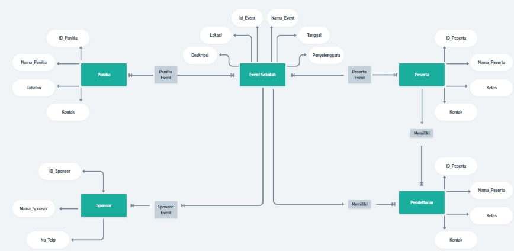

# Tabel Keaktifan

| No  | Nama             | Peran                      | Nilai |
| --- | ---------------- | -------------------------- | ----- |
| 1   | Fachri Ramadan   | Mencari Materi             | 3     |
| 2   | M. Nafan Nabil N | Mencari Materi             | 3     |
| 3   | Raihan Alfazhari | Menggabungkan semua materi | 3     |
| 4   | Muhammad Fadhil  | Mencari Materi             | 3     |
**Keterangan :**
0 : Tidak Aktif
1 : Kurang Aktif
2 : Cukup Aktif
3 : Sangat Aktif
# Jelaskan setiap relasi yang terjadi pada ERD kelompok (Proyek basis data sekolah) jelaskan setiap relasi tabel yang terjadi mengapa kardinalitasnya 1:1, 1:N, N:N.  

### Penjelasan
**1. Panitia - Event Sekolah (Many-to-Many)**
- Panitia - Event Sekolah (Many-to-Many / N)
  Relasi: Setiap panitia dapat terlibat dalam beberapa event, dan satu event bisa melibatkan banyak panitia.
- Kardinalitas: Many-to-Many (N) karena ada kemungkinan setiap panitia berpartisipasi di lebih dari satu event, dan setiap event dapat melibatkan beberapa panitia.
- Tabel Penghubung: Panitia_Event digunakan sebagai tabel penghubung antara Panitia dan Event Sekolah untuk merepresentasikan relasi .

**2. Sponsor - Event Sekolah (Many-to-Many / N)**
- Relasi: Satu sponsor dapat mendukung beberapa event, dan satu event dapat disponsori oleh beberapa sponsor.
- Kardinalitas: Many-to-Many (N) karena satu sponsor dapat terlibat dalam beberapa event, dan satu event dapat memiliki beberapa sponsor.
- Tabel Penghubung: Sponsor_Event digunakan sebagai tabel penghubung antara Sponsor dan Event Sekolah. Tabel ini mencatat ID_Sponsor dan ID_Event untuk menunjukkan sponsor mana yang mendukung event tertentu.

**3. Peserta - Event Sekolah (Many-to-Many / N)**
- Relasi: Satu peserta dapat mengikuti beberapa event, dan satu event bisa diikuti oleh banyak peserta.
- Kardinalitas: Many-to-Many (N) karena satu peserta bisa berpartisipasi dalam beberapa event, dan satu event bisa dihadiri oleh banyak peserta.
- Tabel Penghubung: Peserta_Event digunakan sebagai tabel penghubung antara Peserta dan Event Sekolah. Tabel ini memiliki ID_Peserta dan ID_Event untuk mencatat partisipasi peserta dalam berbagai event.

**4. Peserta - Pendaftaran (One-to-One / 1:1)**
- Relasi: Setiap peserta hanya memiliki satu pendaftaran, dan setiap pendaftaran hanya terkait dengan satu peserta.
- Kardinalitas: One-to-One (1:1) karena setiap peserta hanya bisa memiliki satu data pendaftaran, dan satu data pendaftaran hanya dapat dimiliki oleh satu peserta.
- Implementasi: Tidak memerlukan tabel penghubung karena ID_Peserta di tabel Pendaftaran sudah cukup untuk mengidentifikasi hubungan langsung antara peserta dan pendaftarannya.

**5. Event Sekolah - Pendaftaran (One-to-Many / 1)**
- Relasi: Satu event dapat memiliki beberapa pendaftaran, tetapi setiap pendaftaran hanya terkait dengan satu event.
- Kardinalitas: One-to-Many (1) karena satu event bisa memiliki banyak pendaftaran, tetapi setiap pendaftaran hanya berlaku untuk satu event.
- Implementasi: Tabel Pendaftaran berisi ID_Event sebagai kunci asing untuk menghubungkan setiap pendaftaran dengan satu event tertentu.   