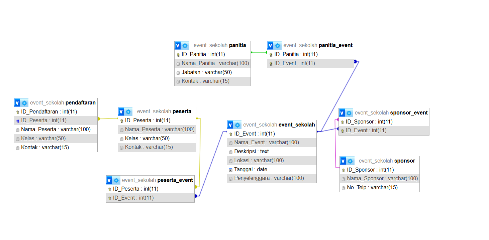
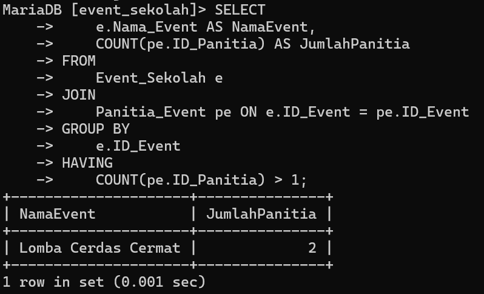
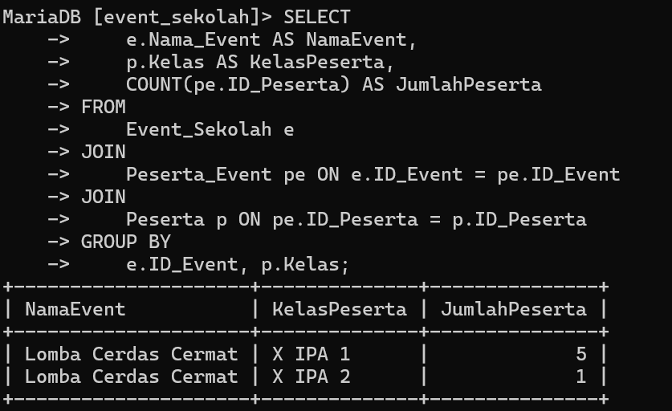

# Tabel Keaktifan

| No  | Nama             | Peran               | Nilai |
| --- | ---------------- | ------------------- | ----- |
| 1   | Fachri Ramadhan  |                     | 3     |
| 2   | M Nafan Nabil.N  | Nonton Bokep  5 Jam | 3     |
| 3   | Raihan Alfahzari |                     | 3     |
| 4   | Muhammad Fadil   |                     | 3     |
**Keterangan :**
0 : Tidak Aktif
1 : Kurang Aktif
2 : Cukup Aktif
3 : Sangat Aktif


##  Soal

### 1. Setiap kelompok merancang database di MySQL dari hasil perencanaan ERD-nya masing-masing. Di dalam database tersebut wajib menjadikan tabel berelasi, dengan menambah foreign key.
### 2. Selanjutnya tampilkan datanya secara kontekstual dengan menggunakan query relasi, group by, dan having secara bersamaan dalam satu query. Buatlah minimal sebanyak 2 contoh.
### 3. Sertakan pula penjelasan dan analisis kalian pada soal nomor 1 dan 2.


## Jawaban

### 1 Membuat Table Berelasi
 ```mysql
CREATE DATABASE EventSekolah;
USE EventSekolah;
```

**Tabel Panitia**
```mysql
CREATE TABLE Panitia ( ID_Panitia INT AUTO_INCREMENT PRIMARY KEY, Nama_Panitia VARCHAR(100), Jabatan VARCHAR(50), Kontak VARCHAR(15) );
```

**Tabel Sponsor**
```mysql
CREATE TABLE Sponsor ( ID_Sponsor INT AUTO_INCREMENT PRIMARY KEY, Nama_Sponsor VARCHAR(100), No_Telp VARCHAR(15) );
```

**Tabel Event Sekolah** 
```mysql
CREATE TABLE Event_Sekolah ( ID_Event INT AUTO_INCREMENT PRIMARY KEY, Nama_Event VARCHAR(100), Deskripsi TEXT, Lokasi VARCHAR(100), Tanggal DATE, Penyelenggara VARCHAR(100) );
```

**Tabel Peserta** 
```mysql
CREATE TABLE Peserta (
    ID_Peserta INT AUTO_INCREMENT PRIMARY KEY,
    Nama_Peserta VARCHAR(100),
    Kelas VARCHAR(50),
    Kontak VARCHAR(15)
);

```

#### Membuat table Relasional

**Tabel Panitia_Event**
```mysql
CREATE TABLE Panitia_Event (
    ID_Panitia INT,
    ID_Event INT,
    PRIMARY KEY (ID_Panitia, ID_Event),
    FOREIGN KEY (ID_Panitia) REFERENCES Panitia(ID_Panitia),
    FOREIGN KEY (ID_Event) REFERENCES Event_Sekolah(ID_Event)
);

```

**Tabel Sponsor_Evet Sekolah**
```mysql
CREATE TABLE Sponsor_Event (
    ID_Sponsor INT,
    ID_Event INT,
    PRIMARY KEY (ID_Sponsor, ID_Event),
    FOREIGN KEY (ID_Sponsor) REFERENCES Sponsor(ID_Sponsor),
    FOREIGN KEY (ID_Event) REFERENCES Event_Sekolah(ID_Event)
);

```

**Tabel Peserta_Event**
```mysql
CREATE TABLE Peserta_Event (
    ID_Peserta INT,
    ID_Event INT,
    PRIMARY KEY (ID_Peserta, ID_Event),
    FOREIGN KEY (ID_Peserta) REFERENCES Peserta(ID_Peserta),
    FOREIGN KEY (ID_Event) REFERENCES Event_Sekolah(ID_Event)
);

```

**Hasil :**


### 2. Menampilkan Data dengan 2 cara
**Query 1 :**
```mysql
SELECT
    ->     e.Nama_Event AS NamaEvent,
    ->     COUNT(pe.ID_Panitia) AS JumlahPanitia
    -> FROM
    ->     Event_Sekolah e
    -> JOIN
    ->     Panitia_Event pe ON e.ID_Event = pe.ID_Event
    -> GROUP BY
    ->     e.ID_Event
    -> HAVING
    ->     COUNT(pe.ID_Panitia) > 1;
```
**Hasil :**



**Query 2 :**
```mysql
SELECT
    ->     e.Nama_Event AS NamaEvent,
    ->     p.Kelas AS KelasPeserta,
    ->     COUNT(pe.ID_Peserta) AS JumlahPeserta
    -> FROM
    ->     Event_Sekolah e
    -> JOIN
    ->     Peserta_Event pe ON e.ID_Event = pe.ID_Event
    -> JOIN
    ->     Peserta p ON pe.ID_Peserta = p.ID_Peserta
    -> GROUP BY
    ->     e.ID_Event, p.Kelas;
```
**Hasil :**



### 3. Penjelasan Dan Analisis
**Nomor 1 :**
#### **Struktur Tabel**

1. **Tabel `event_sekolah`:**
    
    - Menyimpan informasi tentang event sekolah, seperti nama event, deskripsi, lokasi, tanggal, dan penyelenggara.
    - **Primary Key:** `ID_Event`.
2. **Tabel `panitia`:**
    
    - Berisi data panitia yang mengelola event, termasuk nama panitia, jabatan, dan kontak.
    - **Primary Key:** `ID_Panitia`.
3. **Tabel `panitia_event`:**
    
    - Tabel penghubung untuk relasi _many-to-many_ antara panitia dan event.
    - **Foreign Keys:**
        - `ID_Panitia` (mengacu ke tabel `panitia`).
        - `ID_Event` (mengacu ke tabel `event_sekolah`).
4. **Tabel `sponsor`:**
    
    - Menyimpan data sponsor, seperti nama sponsor dan nomor telepon.
    - **Primary Key:** `ID_Sponsor`.
5. **Tabel `sponsor_event`:**
    
    - Tabel penghubung untuk relasi _many-to-many_ antara sponsor dan event.
    - **Foreign Keys:**
        - `ID_Sponsor` (mengacu ke tabel `sponsor`).
        - `ID_Event` (mengacu ke tabel `event_sekolah`).
6. **Tabel `peserta`:**
    
    - Berisi data peserta, termasuk nama, kelas, dan kontak.
    - **Primary Key:** `ID_Peserta`.
7. **Tabel `peserta_event`:**
    
    - Tabel penghubung untuk relasi _many-to-many_ antara peserta dan event.
    - **Foreign Keys:**
        - `ID_Peserta` (mengacu ke tabel `peserta`).
        - `ID_Event` (mengacu ke tabel `event_sekolah`).

---

#### **Relasi Antar-Tabel**

1. **`event_sekolah` dengan `panitia`:**
    
    - Relasi _many-to-many_ melalui tabel `panitia_event`.
    - Satu event dapat melibatkan banyak panitia, dan seorang panitia bisa menangani lebih dari satu event.
2. **`event_sekolah` dengan `sponsor`:**
    
    - Relasi _many-to-many_ melalui tabel `sponsor_event`.
    - Satu event dapat memiliki banyak sponsor, dan satu sponsor bisa mendukung lebih dari satu event.
3. **`event_sekolah` dengan `peserta`:**
    
    - Relasi _many-to-many_ melalui tabel `peserta_event`.
    - Satu event dapat diikuti oleh banyak peserta, dan seorang peserta bisa mengikuti lebih dari satu event.

---

#### **Analisis Struktur**

1. **Keunggulan:**
    
    - Desain sudah optimal dengan penggunaan tabel penghubung (_bridge tables_) untuk mengatasi relasi _many-to-many_.
    - Menggunakan _foreign key constraints_ untuk memastikan referensial integritas data.
2. **Kekurangan:**
    
    - Tabel seperti `peserta_event` dan `panitia_event` hanya menyimpan ID referensi. Jika ingin menyimpan data tambahan seperti waktu pendaftaran atau peran panitia, perlu menambahkan kolom tambahan.
3. **Fleksibilitas:**
    
    - Struktur ini fleksibel untuk menambah data baru, seperti menambahkan panitia, peserta, atau sponsor tanpa mengubah skema utama.
4. **Penggunaan:**
    
    - Cocok untuk aplikasi manajemen event sekolah yang melibatkan berbagai pihak, seperti panitia, sponsor, dan peserta.


**Nomor 2 :**
**1.** **Analisis Query yang Diberikan**

1. **Tujuan Query:**
    
    - Menampilkan nama event (`NamaEvent`) beserta jumlah panitia (`JumlahPanitia`) untuk setiap event yang memiliki lebih dari satu panitia.
2. **Langkah Kerja Query:**
    
    - **Tabel yang Terlibat:**
        - `Event_Sekolah` (`e`)
        - `Panitia_Event` (`pe`)
    - **JOIN:** Menggabungkan tabel `Event_Sekolah` dan `Panitia_Event` menggunakan kolom `ID_Event`.
    - **COUNT:** Menghitung jumlah panitia (`ID_Panitia`) per event.
    - **GROUP BY:** Mengelompokkan data berdasarkan `ID_Event`.
    - **HAVING:** Menyaring hanya event yang memiliki lebih dari satu panitia.


**2** **Penjelasan Query**

1. **`SELECT`:**
    
    - `e.Nama_Event AS NamaEvent`: Mengambil nama event.
    - `p.Kelas AS KelasPeserta`: Mengambil nama kelas peserta.
    - `COUNT(pe.ID_Peserta) AS JumlahPeserta`: Menghitung jumlah peserta untuk setiap kombinasi event dan kelas.
2. **`JOIN`:**
    
    - Tabel `Event_Sekolah` (`e`) bergabung dengan `Peserta_Event` (`pe`) melalui kolom `ID_Event`.
    - Tabel `Peserta_Event` bergabung dengan `Peserta` (`p`) melalui kolom `ID_Peserta`.
3. **`GROUP BY`:**
    
    - Data dikelompokkan berdasarkan kombinasi `e.ID_Event` (event) dan `p.Kelas` (kelas).
4. **`HAVING`:**
    
    - Syarat hanya menampilkan kelas dengan jumlah peserta lebih dari 2.