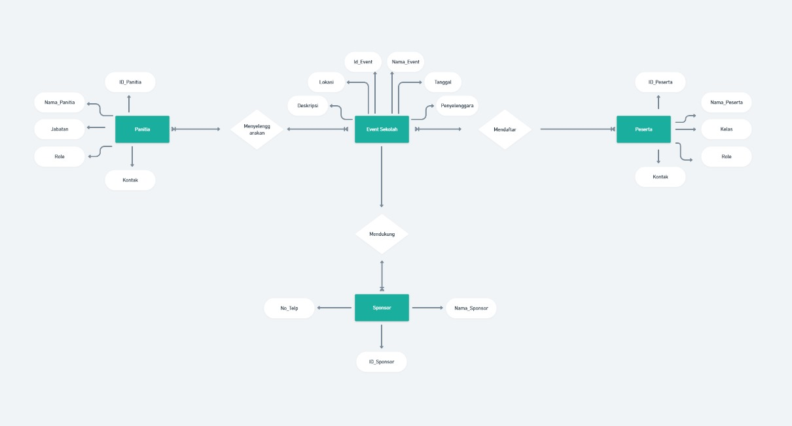

     # Tabel Keaktifan

| No  | Nama             | Peran          | Nilai |
| --- | ---------------- | -------------- | ----- |
| 1   | Fachri Ramadhan  | MencarI Materi | 3     |
| 2   | M Nafan Nabil.N  | Mencari Materi | 3     |
| 3   | Raihan Alfahzari | Mencari Materi | 3     |
| 4   | Muhammad Fadil   | Mencari Materi | 3     |
**Keterangan :**
0 : Tidak Aktif
1 : Kurang Aktif
2 : Cukup Aktif
3 : Sangat Aktif





##  Soal

### 1. Setiap kelompok merancang database di MySQL dari hasil perencanaan ERD-nya masing-masing. Di dalam database tersebut wajib menjadikan tabel berelasi, dengan menambah foreign key.
### 2. Selanjutnya tampilkan datanya secara kontekstual dengan menggunakan query relasi, group by, dan having secara bersamaan dalam satu query. Buatlah minimal sebanyak 2 contoh.
### 3. Sertakan pula penjelasan dan analisis kalian pada soal nomor 1 dan 2.

## Jawaban

### 1 Membuat Table Berelasi
 ```mysql
CREATE DATABASE EventSekolah;
USE EventSekolah;
```

**Tabel Panitia**
```mysql
CREATE TABLE Panitia ( ID_Panitia INT AUTO_INCREMENT PRIMARY KEY, Nama_Panitia VARCHAR(100), Jabatan VARCHAR(50), Kontak VARCHAR(15) );
```

**Tabel Sponsor**
```mysql
CREATE TABLE Sponsor ( ID_Sponsor INT AUTO_INCREMENT PRIMARY KEY, Nama_Sponsor VARCHAR(100), No_Telp VARCHAR(15) );
```

**Tabel Event Sekolah** 
```mysql
CREATE TABLE Event_Sekolah ( ID_Event INT AUTO_INCREMENT PRIMARY KEY, Nama_Event VARCHAR(100), Deskripsi TEXT, Lokasi VARCHAR(100), Tanggal DATE, Penyelenggara VARCHAR(100) );
```

**Tabel Peserta** 
```mysql
CREATE TABLE Peserta (
    ID_Peserta INT AUTO_INCREMENT PRIMARY KEY,
    Nama_Peserta VARCHAR(100),
    Kelas VARCHAR(50),
    Kontak VARCHAR(15)
);

```

#### Membuat table Relasional

**Tabel Panitia_Event**
```mysql
CREATE TABLE panitia_event (
    ID_Panitia_Event INT(11) PRIMARY KEY AUTO_INCREMENT,
    ID_Panitia INT(11),
    ID_Event INT(11),
    FOREIGN KEY (ID_Panitia) REFERENCES panitia(ID_Panitia),
    FOREIGN KEY (ID_Event) REFERENCES event_sekolah(ID_Event)
);

```

**Tabel Sponsor_Event**
```mysql
CREATE TABLE sponsor_event (
    ID_Sponsor_Event INT(11) PRIMARY KEY AUTO_INCREMENT,
    ID_Sponsor INT(11),
    ID_Event INT(11),
    FOREIGN KEY (ID_Sponsor) REFERENCES sponsor(ID_Sponsor),
    FOREIGN KEY (ID_Event) REFERENCES event_sekolah(ID_Event)
);


```

**Tabel Pendaftaran_Peserta
```mysql
CREATE TABLE pendaftaran_peserta (
    ID_Peserta_Event INT(11) PRIMARY KEY AUTO_INCREMENT,
    ID_Peserta INT(11),
    ID_Event INT(11),
    FOREIGN KEY (ID_Peserta) REFERENCES peserta(ID_Peserta),
    FOREIGN KEY (ID_Event) REFERENCES event_sekolah(ID_Event)
);

```

**Hasil :**


#### **Struktur Tabel**

1. **Tabel `event_sekolah`:**
    - Menyimpan informasi tentang event sekolah, seperti nama event, deskripsi, lokasi, tanggal, dan penyelenggara.
    - **Primary Key:** `ID_Event`.
2. **Tabel `paniti a`:*
    - Berisi data panitia yang mengelola event, termasuk nama panitia, jabatan, dan kontak.
    - **Primary Key:** `ID_Panitia`.
3. **Tabel `panitia_event`:**
    - Tabel penghubung untuk relasi _many-to-many_ antara panitia dan event.
    - **Foreign Keys:**
        - `ID_Panitia` (mengacu ke tabel `panitia`).
        - `ID_Event` (mengacu ke tabel `event_sekolah`).
4. **Tabel `sponsor`:**
    - Menyimpan data sponsor, seperti nama sponsor dan nomor telepon.
    - **Primary Key:** `ID_Sponsor`.
5. **Tabel `sponsor_event`:**
    - Tabel penghubung untuk relasi _many-to-many_ antara sponsor dan event.
    - **Foreign Keys:**
        - `ID_Sponsor` (mengacu ke tabel `sponsor`).
        - `ID_Event` (mengacu ke tabel `event_sekolah`).
6. **Tabel `peserta`:**
    - Berisi data peserta, termasuk nama, kelas, dan kontak.
    - **Primary Key:** `ID_Peserta`.
7. **Tabel `peserta_event`:**
    - Tabel penghubung untuk relasi _many-to-many_ antara peserta dan event.
    - **Foreign Keys:**
        - `ID_Peserta` (mengacu ke tabel `peserta`).
        - `ID_Event` (mengacu ke tabel `event_sekolah`).

---


#### **Relasi Antar-Tabel Many-to-Many**

1. **`event_sekolah` dengan `panitia`:**
    
    - Relasi _many-to-many_ melalui tabel `panitia_event`.
    - Tabel event_sekolah terhubung dengan tabel panitia karena hubungan antar panitia dan event tidak terbatas. Panitia dapat berpartisipasi dalam berbagai event, dan setiap event dapat memiliki lebih dari satu panitia.
    - didalam relasi tabel event_sekolah dengan tabel panitia terdapat tabel pivot atau tabel penghubung bernama tabel `panitia_event`  dan terdapat didalamnya data berupa `ID_Panitia_Event`  sebagai Primary Key adapun `id_panitia` sebagai Foreign key dan `id_event`  sebagai Foreign key 

2. **`event_sekolah` dengan `sponsor`:**
    
    - Relasi _many-to-many_ melalui tabel `sponsor_event`.
    - Tabel event_sekolah terhubung dengan tabel sponsor karena Satu sponsor bisa terlibat dalam beberapa event, dan satu event dapat memiliki beberapa sponsor
    - didalam relasi tabel event_sekolah dengan tabel sponsor terdapat tabel pivot atau tabel penghubung bernama tabel `sponsor_event`  dan terdapat didalamnya data berupa`ID_Sponsor_Event` sebagai Primary Key adapun `id_sponsor` sebagai Foreign key `id_event` sebagai Foreign key
3. **`event_sekolah` dengan `peserta`:**
    
    - Relasi _many-to-many_ melalui tabel `pendaftaran_peserta.
    - Tabel event_sekolah terhubung dengan tabel peserta karena Satu event dapat diikuti oleh banyak peserta, dan seorang peserta bisa mengikuti lebih dari satu event 
    - didalam relasi tabel event_sekolah dengan tabel peserta terdapat tabel pivot atau tabel penghubung bernama tabel peserta_event  dan terdapat didalamnya data berupa `ID_Peserta_Event` sebagai Primary Key adapun `id_peserta` sebagai Foreign Key dan `id_event` sebagai Foreign Key

---
### 2. Menampilkan Data dengan 2 cara
**Query 1 :**
**Tujuan :** Querry berikut memiliki tujuan untuk menampilkan mata lomba yang jumlah panitianya lebih dari `1`
**Cara Relasi :** table di relasi dengan `join` dan table yang terelasi adalah table `event_sekolah` dengan table `panitia` yang lebih tepatnya data yang di ambil adalah `id_panitia` yang di ubah menjadi `JumlahPanitia`
**Cara Agregasi :** di query berikut kami menghitung seluruh jumlah panitia menggunkan agregasi `count` tepatnya pada baris ke 3, lalu kami memberikan syarat dengan `Having` lalu menggunakan kembali agregasi `count` lalu dengan syarat panitia yang `> 1`.

```mysql
SELECT
    e.Nama_Event AS NamaEvent,
    COUNT(pe.ID_Panitia) AS JumlahPanitia
FROM
    Event_Sekolah e
JOIN
    Panitia_Event pe ON e.ID_Event = pe.ID_Event
GROUP BY
    e.ID_Event, e.Nama_Event
HAVING
    COUNT(pe.ID_Panitia) > 1;
```

**Hasil :**


**Query 2 :**
**Tujuan :** Query berikut bertujuan untuk menampilkan nama event dengan jumlah peserta yang lebih dari 2.
**Cara Relasi :** table di relasi dengan `join` dan table yang terelasi adalah table `event_sekolah` dengan table "`peserta`" lebih tepatnya data yang di ambil adalah data `id_peserta`
**Cara Agregasi :** di query berikut kami menghitung seluruh jumlah peserta menggunkan agregasi `count` tepatnya pada baris ke 4, lalu kami memberikan syarat dengan `Having` lalu menggunakan kembali agregasi `count` lalu dengan syarat peserta   yang `> 2`.%

```mysql
SELECT
    e.Nama_Event AS NamaEvent,
    p.Kelas AS KelasPeserta,
    COUNT(pe.ID_Peserta) AS JumlahPeserta
FROM
    Event_Sekolah e
JOIN
    Peserta_Event pe ON e.ID_Event = pe.ID_Event
JOIN
    Peserta p ON pe.ID_Peserta = p.ID_Peserta
GROUP BY
    e.ID_Event, e.Nama_Event, p.Kelas
HAVING
    COUNT(pe.ID_Peserta) > 2; 
```

**Hasil :**


### Penjelasan Query 1 dan 2

**Nomor 2 :**
**1.** **Analisis Query yang Diberikan**
1. **Tujuan Query:**
    - Menampilkan nama event (`NamaEvent`) beserta jumlah panitia (`JumlahPanitia`) untuk setiap event yang memiliki lebih dari satu panitia.
2. **Langkah Kerja Query:**
    - **Tabel yang Terlibat:**
        - `Event_Sekolah` (`e`)
        - `Panitia_Event` (`pe`)
    - **JOIN:** Menggabungkan tabel `Event_Sekolah` dan `Panitia_Event` menggunakan kolom `ID_Event`.
    - **COUNT:** Menghitung jumlah panitia (`ID_Panitia`) per event.
    - **GROUP BY:** Mengelompokkan data berdasarkan `ID_Event`.
    - **HAVING:** Menyaring hanya event yang memiliki lebih dari satu panitia.


**2** **Penjelasan Query 1**
1. `SELECT`: Memilih kolom yang ingin ditampilkan, yaitu `Nama_Event` dan `JumlahPanitia`.
2. `FROM`: Menentukan tabel utama yang digunakan, yaitu `Event_Sekolah`.
3. `JOIN`: Menggabungkan tabel `Event_Sekolah` dengan tabel `Panitia_Event` berdasarkan kolom `ID_Event`.
4. `GROUP BY`: Mengelompokkan hasil query berdasarkan kolom `ID_Event` dan `Nama_Event`.
5. `HAVING`: Menentukan kondisi untuk hasil query, yaitu hanya menampilkan event yang memiliki lebih dari satu panitia (`COUNT(pe.ID_Panitia) > 1`).
   
**2** **Penjelasan Query 2**
1. `SELECT`: Memilih kolom yang ingin ditampilkan, yaitu `Nama_Event`, `KelasPeserta`, dan `JumlahPeserta`.
2. `FROM`: Menentukan tabel utama yang digunakan, yaitu `Event_Sekolah`.
3. `JOIN` (pertama): Menggabungkan tabel `Event_Sekolah` dengan tabel `Peserta_Event` berdasarkan kolom `ID_Event`.
4. `JOIN` (kedua): Menggabungkan tabel `Peserta_Event` dengan tabel `Peserta` berdasarkan kolom `ID_Peserta`.
5. `GROUP BY`: Mengelompokkan hasil query berdasarkan kolom `ID_Event`, `Nama_Event`, dan `Kelas`.
6. `HAVING`: Menentukan kondisi untuk hasil query, yaitu hanya menampilkan event yang memiliki lebih dari dua peserta (`COUNT(pe.ID_Peserta) > 2`).
