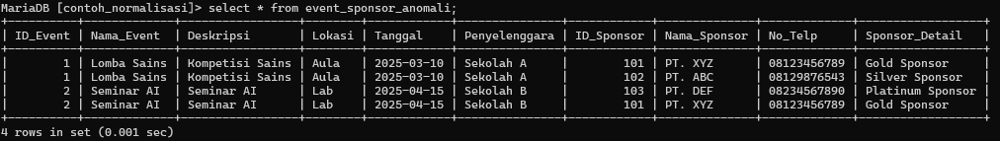
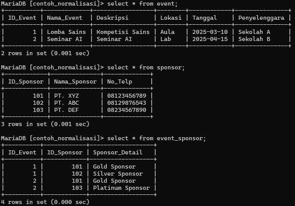
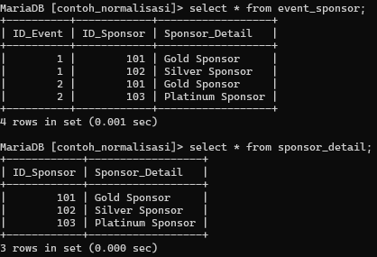

| No  | Nama             | Peran                  | Nilai |
| --- | ---------------- | ---------------------- | ----- |
| 1   | Fachri Ramadan   | Menjawab soal nomor 1. | 3     |
| 2   | M.Nafan Nabil N  | Menjawab soal nomor 2. | 3     |
| 3   | Raihan Alfazhari | Menjawab soal nomor 1. | 3     |
| 4   | Muhammad Fadhil  | Menjawab soal nomor 2. | 3     |

# Soal 1

## 1. Jelaskan apa yang dimaksud dengan normalisasi database?
**Normalisasi database adalah proses pengorganisasian data dalam suatu basis data untuk mengurangi redundansi dan meningkatkan integritas data. Proses yang terjadi didalam normalisasi database mencangkup membersihkan atau mengatur data sehingga mampu menciptakan data dan terstruktur dengan baik sesuai stabdar. Dalam proses normalisasi, tabel-tabel dalam database diatur sedemikian rupa sehingga setiap tabel hanya mengandung informasi yang terkait langsung dengan satu entitas tertentu.**

## 2. Apa yang menjadi tujuan pembuatan database perlu dinormalisasikan?
**Menghilangkan Redudansi Data
Mengurangi Kompleksitas Data
Mempermudah proses analis dan pengornasisasian data**

## 3. Uraikan proses singkat tentang normalisasi dari tahap 1NF hingga 5NF!
singkatnya tahap tersebut berfungsi untuk membuat tampilan dan penggunaan data se efesien mungkin, penjelasannya sebagai berikut :
- **First Normal Form (1NF)** → Pastikan setiap kolom hanya berisi satu nilai (tidak ada data yang ditulis berulang).
    
- **Second Normal Form (2NF)** → Data harus sudah dalam 1NF, lalu pastikan setiap kolom hanya bergantung pada seluruh kunci utama.
    
- **Third Normal Form (3NF)** → Data harus sudah dalam 2NF, lalu pastikan tidak ada kolom yang bergantung pada kolom non-kunci utama. Setiap kolom hanya boleh bergantung langsung pada kunci utama.
    
- **Fourth Normal Form (4NF)** → Data harus sudah dalam 3NF, lalu pastikan setiap kolom yang tidak berhubungan tetap dipisahkan ke tabel yang berbeda untuk menghindari duplikasi yang tidak perlu.
    
- **Fifth Normal Form (5NF)** → Data harus sudah dalam 4NF, lalu pastikan tabel tidak bisa dipecah lebih lanjut tanpa kehilangan informasi saat digabung kembali.
- 
## 4. Buatlah contoh normalisasi database minimal dari tahap 1NF hingga 3NF 
### **Masalah (Tabel Anomali)**
Sebelum dilakukan normalisasi, tabel masih memiliki **anomali** dalam strukturnya. Berikut adalah tabel **event_sponsor_anomali** sebelum normalisasi:

  **Masalah pada tabel ini:**
1. **Redundansi Data:** Informasi event berulang setiap kali ada sponsor baru, menyebabkan penyimpanan yang tidak efisien.
2. **Anomali Update:** Jika satu event ingin diubah (misalnya lokasi), harus diubah di semua baris yang memiliki event tersebut.
3. **Anomali Insert:** Tidak bisa menambahkan sponsor tanpa event.
4. **Anomali Delete:** Jika semua sponsor dihapus, informasi event juga bisa hilang.
5. **Dependensi Transitif:** `Sponsor_Detail` bergantung pada `ID_Sponsor`, bukan `ID_Event`, yang melanggar aturan 3NF.

### **Tujuan Normalisasi**
- Menghilangkan redundansi data
- Memudahkan update dan maintenance data
- Mencegah anomali dalam proses insert, update, delete
- Memastikan setiap tabel hanya memiliki data yang sesuai dengan dependensi kunci utama

### **1NF**
**Langkah 1NF:**
- **Setiap kolom harus memiliki nilai atomik (tidak boleh array atau multi-value).**
- **Setiap baris harus unik, tanpa duplikasi.**

Pada tabel **event_sponsor_anomali**, sudah memenuhi aturan nilai atomik, tetapi masih ada redundansi. Untuk 1NF, kita pisahkan tabel **event** dan **sponsor**.

#### **Tabel setelah 1NF**

### **2NF**
**Langkah 2NF:**
- **Harus sudah dalam bentuk 1NF.**
- **Menghapus dependensi parsial:** Kolom non-kunci harus bergantung sepenuhnya pada primary key.

Dalam tabel **event_sponsor**, kolom `Sponsor_Detail` hanya bergantung pada `ID_Sponsor`, bukan pada kombinasi `ID_Event` dan `ID_Sponsor`. Maka, kita pisahkan ke tabel baru.

#### **Tabel setelah 2NF**

### **3NF**
**Langkah 3NF:**
- **Harus sudah dalam bentuk 2NF.**
- **Menghilangkan dependensi transitif:** Semua kolom non-kunci hanya boleh bergantung pada primary key.

Pada tahap ini, semua tabel sudah memenuhi aturan 3NF karena semua data dalam tabel hanya bergantung pada **primary key**.

#### **Hasil Akhir dalam 3NF**
1. **event** (ID_Event sebagai primary key)
2. **sponsor** (ID_Sponsor sebagai primary key)
3. **event_sponsor** (menghubungkan event dan sponsor)
4. **sponsor_detail** (memisahkan sponsor_detail dari event_sponsor)

### **Kesimpulan Normalisasi (1NF - 3NF)**
Normalisasi adalah proses **mengorganisir data dalam database** untuk mengurangi **redundansi**, **mencegah anomali**, dan **meningkatkan efisiensi penyimpanan serta pemeliharaan data**. Dalam studi kasus ini, kita telah melalui **tiga tahapan normalisasi** untuk menyusun struktur database yang lebih optimal.

#### **Ringkasan Tiap Tahap Normalisasi:**
1. **Tabel Anomali (Sebelum Normalisasi)**
    - Tabel masih mengandung **redundansi data**, **anomali update**, **anomali insert/delete**, dan **dependensi transitif**.
    - Data event berulang setiap kali ada sponsor, menyebabkan **ketidakefisienan dalam penyimpanan dan pemrosesan data**.
2. **Tahap 1NF (First Normal Form)**
    - Menghilangkan nilai yang tidak atomik dalam satu kolom.
    - Memisahkan **event**, **sponsor**, dan **hubungan event_sponsor** dalam tabel yang lebih terstruktur.
    - Hasilnya: **event, sponsor, dan event_sponsor** menjadi tabel yang lebih rapi.
3. **Tahap 2NF (Second Normal Form)**
    
    - Memastikan setiap kolom non-kunci **bergantung sepenuhnya pada primary key**.
    - Menghapus **dependensi parsial** dengan memindahkan `Sponsor_Detail` dari **event_sponsor** ke tabel baru **sponsor_detail**.
    - Hasilnya: Data sponsor lebih terorganisir, dan **tidak ada lagi atribut yang hanya bergantung pada sebagian primary key**.
4. **Tahap 3NF (Third Normal Form)**
    - Menghapus **dependensi transitif** di mana kolom non-kunci hanya boleh bergantung langsung pada primary key.
    - Semua tabel kini hanya menyimpan **data yang relevan** dengan entitas masing-masing.
    - Hasilnya: **Database lebih efisien, tidak ada data yang saling bergantung secara tidak langsung**, sehingga mempermudah pemeliharaan dan query data.
---

## Soal 2 Buatkan masing-masing 4 soal pilihan ganda tentang lrs dan normalisasi
### 1. Apa yang membedakan 4NF dengan 3NF?
#### a) 4NF memastikan tidak ada ketergantungan transitif.
#### b) 4NF menghilangkan ketergantungan multivalued, sedangkan 3NF mengatasi ketergantungan transitif. ✅
#### c) 4NF mengizinkan beberapa primary key dalam satu tabel.
#### d) 4NF hanya digunakan dalam database non-relasional.
### 2. Apa syarat utama agar sebuah tabel bisa disebut dalam bentuk normal pertama (1NF)?
#### a) Tidak ada nilai duplikat dalam tabel.
#### b) Setiap kolom harus memiliki indeks.
#### c) Setiap atribut hanya menyimpan satu nilai (atomicity).✅
#### d) Tabel memiliki minimal satu foreign key.
### 3. Apa yang membedakan 4NF dan 5NF dalam normalisasi?
#### a) 4NF mengatasi ketergantungan multivalued, sedangkan 5NF mengatasi join dependency. ✅
#### b) 5NF hanya berlaku untuk database NoSQL.
#### c) 4NF hanya digunakan jika ada primary key lebih dari satu atribut.
#### d) 5NF memastikan semua foreign key dihapus.
### 4. Apa tujuan utama dari normalisasi hingga 5NF?
#### a) Menghilangkan redundansi akibat join dependency. ✅
#### b) Menghapus semua foreign key.
#### c) Meningkatkan kecepatan insert data.
#### d) Memastikan tidak ada atribut yang memiliki nilai NULL.
### 5. Apa tujuan utama dari Logical Relational Schema?
#### a) Mengatur bagaimana data disimpan secara fisik di dalam basis data.
#### b) Menentukan struktur tabel, atribut, primary key, dan relasi antar tabel tanpa mempertimbangkan penyimpanan fisik. ✅
#### c) Mengoptimalkan performa query SQL secara otomatis.
#### d) Mengatur indexing dan partisi database.
### 6. Dalam Logical Relational Schema, atribut apa yang harus unik dan tidak boleh NULL?
#### a) Foreign Key
#### b) Candidate Key
#### c) Primary Key ✅
#### d) Super Key
### 7. Normalisasi dalam LRS bertujuan untuk...?
#### a) Mengurangi jumlah tabel dalam basis data.
#### b) Menghindari redundansi dan anomali data. ✅
#### c) Meningkatkan kecepatan eksekusi query.
#### d) Mengubah tabel menjadi bentuk lebih sederhana.
### 8. Apa yang membedakan Primary Key dan Foreign Key dalam LRS?
#### a) Primary Key harus selalu unik, sedangkan Foreign Key tidak boleh berisi NULL.
#### b)  Foreign Key harus selalu bertipe sama dengan atribut Primary Key.
#### c) Primary Key dapat berupa lebih dari satu atribut, sedangkan Foreign Key hanya bisa satu atribut.
#### d) Primary Key adalah pengenal unik dalam tabel, sementara Foreign Key digunakan untuk merujuk ke Primary Key di tabel lain. ✅
