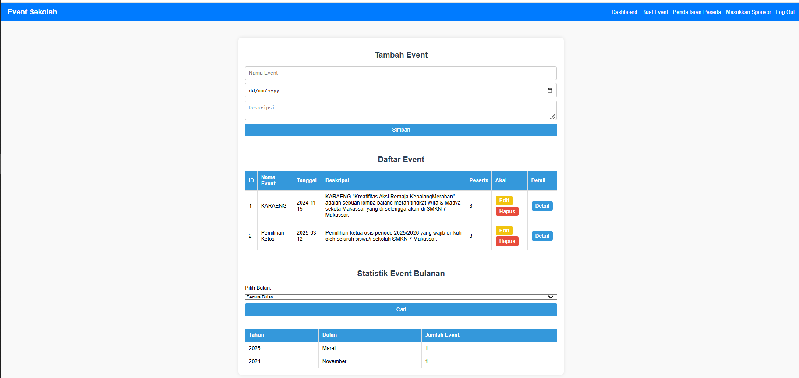
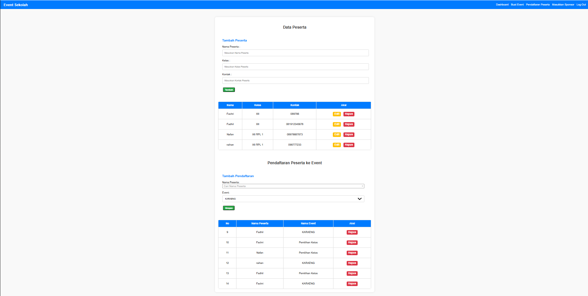
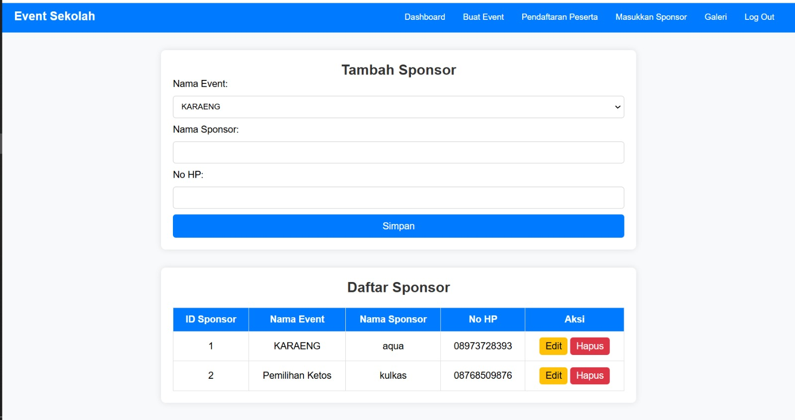
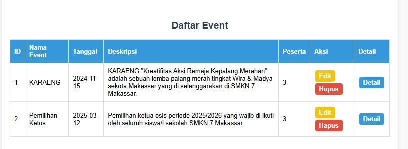
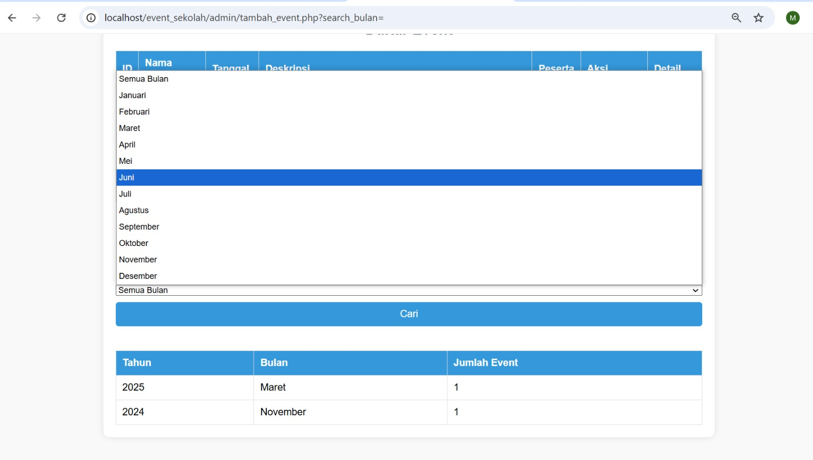

# Tabel Keaktifan

| No  | Nama             | Peran               | Nilai |
| --- | ---------------- | ------------------- | ----- |
| 1   | Fachri Ramadan   | Mengerjakan Proyek. | 3     |
| 2   | M.Nafan Nabil N  | Mengerjakan Proyek. | 3     |
| 3   | Raihan Alfazhari | Mengerjakan Proyek. | 3     |
| 4   | Muhammad Fadhil  | Mengerjakan Proyek. | 3     |
**Keterangan :**
0 : Tidak Aktif
1 : Kurang Aktif
2 : Cukup Aktif
3 : Sangat Aktif
# Soal
# 1. Deskripsi fitur: menjelaskan gambaran umum dari masing-masing fitur dari aplikasi yang dibuat

# 2. Database: gambar database dan penjelasan dari masing-masing tabel yang digunakan dalam aplikasi

# 3. Rincian fitur: setiap fitur disusun dalam bentuk poin perpoin yang masing-masing fitur memaparkan screenshoot fitur, kode program front-end, kode program backend, analisis. Adapun analisis berisi penjelasan kode program, database yang digunakan disertai peran fitur tsb dalam mengelola database yang terkait

# 4. Relasi: menjelaskan relasi tabel yang digunakan dalam fitur tertentu. Penjelasan berupa tujuan dari relasi tsb, analisis dari query relasi yang digunakan, dan bagaimana cara kerja fitur terhadap relasi tsb.

# 5. Agregasi: menjelaskan agregasi (GROUP BY & HAVING) yang digunakan dalam fitur tertentu . Penjelasan berupa tujuan dari agregasi tsb, analisis dari query agregasi yang digunakan, dan bagaimana cara kerja fitur terhadap agregasi tsb.

# 6. Autentikasi: menjelaskan  tentang fitur-fitur yang diproteksi untuk dibatasi aksesnya sesuai dengan jenis usernya dan apa tujuannya beserta penjelasan berupa analisis programnya.
--- 
## 1. Penjelasan Secara Umum
	Aplikasi **Event Sekolah** ini dirancang untuk memudahkan pengelolaan berbagai kegiatan atau event yang diadakan di lingkungan sekolah. Fitur-fitur utama yang ada di dalam aplikasi ini saling terhubung dan berfungsi untuk mendata, mengelola, serta memantau jalannya setiap event dengan rapi dan terstruktur.

	Fitur pertama adalah **manajemen event**, yang memungkinkan admin atau penyelenggara untuk mencatat detail dari setiap event. Informasi seperti nama event, deskripsi, lokasi, tanggal pelaksanaan, dan siapa penyelenggaranya dimasukkan ke dalam sistem. Fitur ini menjadi dasar dari aplikasi karena semua aktivitas lain bergantung pada data event yang sudah dibuat.

	Selanjutnya, terdapat fitur **pendaftaran peserta**, yang memberikan kemudahan bagi siswa maupun guru untuk mendaftar ke dalam event yang diselenggarakan. Data peserta yang mendaftar akan tersimpan di sistem, lengkap dengan informasi pribadi seperti nama, kelas, kontak, dan peran mereka (misalnya sebagai siswa atau guru). Dengan fitur ini, panitia bisa dengan mudah melihat siapa saja yang sudah mendaftar pada setiap event.

	Tidak hanya itu, aplikasi ini juga memiliki fitur **manajemen sponsor**, di mana informasi sponsor yang mendukung acara bisa dicatat. Nama sponsor, kontak, serta event mana saja yang mereka sponsori semuanya tercatat di sistem. Dengan adanya fitur ini, pihak sekolah bisa dengan mudah mengelola kerja sama dengan para sponsor yang memberikan dukungan terhadap event yang diselenggarakan.

	Secara umum, aplikasi ini memungkinkan pihak sekolah untuk mengelola event secara digital dan efisien, mulai dari pencatatan event, pendaftaran peserta, penunjukan panitia, hingga pencatatan sponsor yang terlibat. Semua data yang tersimpan di dalam sistem saling terhubung, sehingga memudahkan pengelolaan informasi secara keseluruhan dan mengurangi risiko data tercecer atau tidak terpantau.

---
## 2. Gambaran dan penjelesan database 
### Contoh gambar database

### Penjelasan Database
- **Peserta** bisa mendaftar ke event melalui tabel **pendaftaran_peserta**.
- **Event** bisa memiliki **sponsor**, yang datanya dikelola dalam tabel **sponsor_event**.
- **Sponsor** bisa mendukung lebih dari satu event, dan sebaliknya, satu event bisa memiliki beberapa sponsor.
####  **Tabel `event_sekolah`**
- Menyimpan informasi tentang event yang diadakan di sekolah.
- **Isi Kolom:**
    - `ID_Event` → ID unik untuk tiap event.
    - `Nama_Event` → Nama event (misalnya: Lomba, Seminar).
    - `Deskripsi` → Penjelasan singkat tentang event.
    - `Lokasi` → Tempat dilaksanakannya event.
    - `Tanggal` → Tanggal event diadakan.
    - `Penyelenggara` → Nama penyelenggara event.
---
###  **Tabel `peserta`**
- Menyimpan data semua peserta yang akan ikut event.
- **Isi Kolom:**
    - `ID_Peserta` → ID unik untuk tiap peserta.
    - `Nama_Peserta` → Nama lengkap peserta.
    - `Kelas` → Kelas dari peserta.
    - `Kontak` → Nomor HP/WA peserta.
    - `Role` → Peran peserta, contoh: "Siswa", "Guru".
---
#### **Tabel `pendaftaran_peserta`**
- Menyimpan data peserta yang mendaftar ke event tertentu.
- **Isi Kolom:**
    - `ID_Peserta_Event` → ID unik pendaftaran peserta di event.
    - `ID_Peserta` → Menghubungkan peserta yang mendaftar.
    - `ID_Event` → Menghubungkan ke event yang didaftarkan
---
####  **Tabel `sponsor`**
- Menyimpan data sponsor yang mendukung event.
- **Isi Kolom:**
    - `ID_Sponsor` → ID unik sponsor.
    - `Nama_Sponsor` → Nama sponsor (misal: perusahaan, toko).
    - `No_Telp` → Nomor kontak sponsor.
---
####  **Tabel `sponsor_event`**
- Relasi antara sponsor dan event yang mereka sponsori.
- **Isi Kolom:**
    - `ID_Sponsor_Event` → ID unik relasi sponsor dengan event.
    - `ID_Sponsor` → Menghubungkan sponsor.
    - `ID_Event` → Menghubungkan event yang disponsori.
---
## 3. Rincian Fitur
### Tambah Event
#### **1. Fitur: Manajemen Event (Tambah, Edit, Hapus)**
#### Kode Program
**PHP**
```php
<?php
session_start();

// Redirect ke halaman login jika pengguna belum login
if (!isset($_SESSION['username'])) {
    header("Location: login.php");
    exit();
}

$servername = "localhost";
$username = "root";
$password = "";
$database = "event_sekolah";

$conn = new mysqli($servername, $username, $password, $database);
if ($conn->connect_error) {
    die("Koneksi gagal: " . $conn->connect_error);
}

// Konversi bulan dari Indonesia ke Inggris
$bulan_indo_to_eng = [
    'januari' => 'january', 'februari' => 'february', 'maret' => 'march',
    'april' => 'april', 'mei' => 'may', 'juni' => 'june',
    'juli' => 'july', 'agustus' => 'august', 'september' => 'september',
    'oktober' => 'october', 'november' => 'november', 'desember' => 'december'
];

// Ambil input pencarian
$search_bulan = isset($_GET['search_bulan']) ? strtolower(trim($_GET['search_bulan'])) : '';
$search_bulan_eng = $bulan_indo_to_eng[$search_bulan] ?? $search_bulan;

// Query statistik event berdasarkan bulan
$sql_statistik = "SELECT YEAR(Tanggal) AS Tahun, MONTHNAME(Tanggal) AS Bulan, COUNT(*) AS Jumlah_Event
                  FROM event_sekolah
                  WHERE (? = '' OR LOWER(MONTHNAME(Tanggal)) = ?)
                  GROUP BY Tahun, Bulan
                  ORDER BY Tahun DESC, Bulan ASC";

// Eksekusi query dengan prepared statement
$stmt = $conn->prepare($sql_statistik);
$stmt->bind_param("ss", $search_bulan_eng, $search_bulan_eng);
$stmt->execute();
$result_statistik = $stmt->get_result();

// Konversi nama bulan ke bahasa Indonesia
$bulan_eng_to_indo = [
    'january' => 'Januari', 'february' => 'Februari', 'march' => 'Maret',
    'april' => 'April', 'may' => 'Mei', 'june' => 'Juni',
    'july' => 'Juli', 'august' => 'Agustus', 'september' => 'September',
    'october' => 'Oktober', 'november' => 'November', 'december' => 'Desember'
];

// Inisialisasi variabel untuk edit
$id_event = "";
$nama_event = "";
$tanggal = "";
$deskripsi = "";
$is_edit = false;

// Tambah atau Update Event
if ($_SERVER["REQUEST_METHOD"] == "POST") {
    $nama = $_POST['nama_event'];
    $tanggal = $_POST['tanggal'];
    $deskripsi = $_POST['deskripsi'];

    if (isset($_POST['id_event']) && !empty($_POST['id_event'])) {
        // Update event
        $id = $_POST['id_event'];
        $sql = "UPDATE event_sekolah SET Nama_Event='$nama', Tanggal='$tanggal', Deskripsi='$deskripsi' WHERE ID_Event=$id";
        echo "<script>alert('Event berhasil diperbarui!'); window.location='tambah_event.php';</script>";
    } else {
        // Tambah event baru
        $sql = "INSERT INTO event_sekolah (Nama_Event, Tanggal, Deskripsi) VALUES ('$nama', '$tanggal', '$deskripsi')";
        echo "<script>alert('Event berhasil ditambahkan!'); window.location='tambah_event.php';</script>";
    }

    if (!$conn->query($sql)) {
        echo "Error: " . $sql . "<br>" . $conn->error;
    }
}

// Hapus Event
if (isset($_GET['hapus'])) {
    $id = $_GET['hapus'];
    $sql = "DELETE FROM event_sekolah WHERE ID_Event=$id";
    if ($conn->query($sql) === TRUE) {
        $conn->query("SET @count = 0;");
        $conn->query("UPDATE event_sekolah SET ID_Event = @count := @count + 1;");
        $conn->query("ALTER TABLE event_sekolah AUTO_INCREMENT = 1;");

        echo "<script>alert('Event berhasil dihapus!'); window.location='tambah_event.php';</script>";
    }
}

// Ambil data event untuk diedit
if (isset($_GET['edit'])) {
    $id = $_GET['edit'];
    $edit_sql = "SELECT * FROM event_sekolah WHERE ID_Event=$id";
    $edit_result = $conn->query($edit_sql);
    $edit_data = $edit_result->fetch_assoc();

    $id_event = $edit_data['ID_Event'];
    $nama_event = $edit_data['Nama_Event'];
    $tanggal = $edit_data['Tanggal'];
    $deskripsi = $edit_data['Deskripsi'];
    $is_edit = true;
}

// Ambil semua data event beserta jumlah peserta
$sql = "SELECT event_sekolah.*, (SELECT COUNT(*) FROM pendaftaran_peserta WHERE pendaftaran_peserta.ID_Event = event_sekolah.ID_Event) AS Jumlah_Peserta FROM event_sekolah";
$result = $conn->query($sql);
?>
```

**HTML**
```html
<!DOCTYPE html>
<html>
<head>
    <title>Kelola Event Sekolah</title>
    <link rel="stylesheet" href="style.css">
</head>
<body>
<?php include 'navbar.php'; ?>

<div class="container">
    <?php if ($_SESSION['role'] == 'admin'): ?>
        <h2><?= $is_edit ? "Edit" : "Tambah" ?> Event</h2>
        <form method="POST" action="">
            <input type="hidden" name="id_event" value="<?= $id_event ?>">
            <input type="text" name="nama_event" placeholder="Nama Event" value="<?= $nama_event ?>" required>
            <input type="date" name="tanggal" value="<?= $tanggal ?>" required>
            <textarea name="deskripsi" placeholder="Deskripsi" required><?= $deskripsi ?></textarea>
            <button type="submit">Simpan</button>
        </form>
        <br>
        <br>
    <?php endif; ?>

    <h2>Daftar Event</h2>
    <table>
        <tr>
            <th>ID</th>
            <th>Nama Event</th>
            <th>Tanggal</th>
            <th>Deskripsi</th>
            <th>Peserta</th>
            <?php if ($_SESSION['role'] == 'admin'): ?>
                <th>Aksi</th>
            <?php endif; ?>
            <th>Detail</th>
        </tr>
        <?php while ($row = $result->fetch_assoc()) { ?>
            <tr>
                <td><?= $row["ID_Event"] ?></td>
                <td><?= $row["Nama_Event"] ?></td>
                <td><?= $row["Tanggal"] ?></td>
                <td><?= $row["Deskripsi"] ?></td>
                <td><?= $row["Jumlah_Peserta"] ?></td>
                <?php if ($_SESSION['role'] == 'admin'): ?>
                    <td class="action-buttons">
                        <a href="?edit=<?= $row['ID_Event'] ?>" class="edit">Edit</a>
                        <a href="?hapus=<?= $row['ID_Event'] ?>" class="delete" onclick="return confirm('Hapus event ini?')">Hapus</a>
                    </td>
                <?php endif; ?>
                <td class="action-buttons">
                    <a href="detail_event.php?id=<?= $row['ID_Event'] ?>" class="detail">Detail</a>
                </td>
            </tr>
        <?php } ?>
    </table>
    <br>
    <br>
    <h2>Statistik Event Bulanan</h2>
    <form method="GET" action="">
        <label for="search_bulan">Pilih Bulan:</label>
        <select name="search_bulan" id="search_bulan">
            <option value="">Semua Bulan</option>
            <?php
            $bulan_list = [
                'januari' => 'Januari', 'februari' => 'Februari', 'maret' => 'Maret',
                'april' => 'April', 'mei' => 'Mei', 'juni' => 'Juni',
                'juli' => 'Juli', 'agustus' => 'Agustus', 'september' => 'September',
                'oktober' => 'Oktober', 'november' => 'November', 'desember' => 'Desember'
            ];
            
            foreach ($bulan_list as $key => $bulan) {
                $selected = ($search_bulan == $key) ? "selected" : "";
                echo "<option value='$key' $selected>$bulan</option>";
            }
            ?>
        </select>
        <button type="submit">Cari</button>
    </form>

    <br>
    <table>
        <tr>
            <th>Tahun</th>
            <th>Bulan</th>
            <th>Jumlah Event</th>
        </tr>
        <?php
        while ($row = $result_statistik->fetch_assoc()) { 
            $bulan_tampil = strtolower($row["Bulan"]);
            ?>
            <tr>
                <td><?= $row["Tahun"] ?></td>
                <td><?= $bulan_eng_to_indo[$bulan_tampil] ?? ucfirst($bulan_tampil) ?></td>
                <td><?= $row["Jumlah_Event"] ?></td>
            </tr>
        <?php } ?>
    </table>
</div>
</body>
</html>
<?php $conn->close(); ?>
```

**CSS**
```css
body {
    font-family: 'Arial', sans-serif;
    margin: 0;
    padding: 0;
    background-color: #f9f9f9;
}
.container {
    max-width: 950px;
    margin: 50px auto;
    background: white;
    padding: 20px;
    border-radius: 10px;
    box-shadow: 0px 0px 10px rgba(0, 0, 0, 0.1);
}
h2 {
    text-align: center;
    color: #2c3e50;
    margin-bottom: 20px;
}
form {
    display: flex;
    flex-direction: column;
    gap: 10px;
}
input, textarea {
    width: 97.5%;
    padding: 10px;
    border: 1px solid #ccc;
    border-radius: 5px;
    font-size: 16px;
}
button {
    background: #3498db;
    color: white;
    padding: 10px;
    border: none;
    border-radius: 5px;
    cursor: pointer;
    font-size: 16px;
    transition: 0.3s;
}
button:hover {
    background: #2980b9;
}
table {
    width: 100%;
    border-collapse: collapse;
    margin-top: 20px;
}
table th, table td {
    padding: 10px;
    border: 1px solid #ddd;
    text-align: left;
}
table th {
    background: #3498db;
    color: white;
}
table tr:hover {
    background: #f1f1f1;
}
.action-buttons a {
    display: inline-block;
    padding: 5px 10px;
    margin: 2px;
    border-radius: 5px;
    text-decoration: none;
    font-weight: bold;
    color: white;
}
.edit {
    background: #f1c40f;
}
.edit:hover {
    background: #f39c12;
}
.delete {
    background: #e74c3c;
}
.delete:hover {
    background: #c0392b;
}
.detail {
    background: #3498db;
}
.detail:hover {
    background: #2980b9;
}
```
#### Foto

#### Penjelasan
##### **Kode Program Front-End (HTML)**
```html
<!-- Form Tambah/Edit Event -->
<h2><?= $is_edit ? "Edit" : "Tambah" ?> Event</h2>
<form method="POST" action="">
    <input type="hidden" name="id_event" value="<?= $id_event ?>">
    <input type="text" name="nama_event" placeholder="Nama Event" value="<?= $nama_event ?>" required>
    <input type="date" name="tanggal" value="<?= $tanggal ?>" required>
    <textarea name="deskripsi" placeholder="Deskripsi" required><?= $deskripsi ?></textarea>
    <button type="submit">Simpan</button>
</form>

<!-- Tabel Daftar Event -->
<table>
    <tr>
        <th>ID</th>
        <th>Nama Event</th>
        <th>Tanggal</th>
        <th>Deskripsi</th>
        <th>Peserta</th>
        <th>Aksi</th>
        <th>Detail</th>
    </tr>
    <?php while ($row = $result->fetch_assoc()) { ?>
        <tr>
            <td><?= $row["ID_Event"] ?></td>
            <td><?= $row["Nama_Event"] ?></td>
            <td><?= $row["Tanggal"] ?></td>
            <td><?= $row["Deskripsi"] ?></td>
            <td><?= $row["Jumlah_Peserta"] ?></td>
            <td class="action-buttons">
                <a href="?edit=<?= $row['ID_Event'] ?>" class="edit">Edit</a>
                <a href="?hapus=<?= $row['ID_Event'] ?>" class="delete" onclick="return confirm('Hapus event ini?')">Hapus</a>
            </td>
            <td class="action-buttons">
                <a href="detail_event.php?id=<?= $row['ID_Event'] ?>" class="detail">Detail</a>
            </td>
        </tr>
    <?php } ?>
</table>
```
##### **Kode Program Back-End (PHP)**
```php
// Tambah atau Update Event
if ($_SERVER["REQUEST_METHOD"] == "POST") {
    $nama = $_POST['nama_event'];
    $tanggal = $_POST['tanggal'];
    $deskripsi = $_POST['deskripsi'];

    if (isset($_POST['id_event']) && !empty($_POST['id_event'])) {
        // Update event
        $id = $_POST['id_event'];
        $sql = "UPDATE event_sekolah SET Nama_Event='$nama', Tanggal='$tanggal', Deskripsi='$deskripsi' WHERE ID_Event=$id";
        echo "<script>alert('Event berhasil diperbarui!'); window.location='tambah_event.php';</script>";
    } else {
        // Tambah event baru
        $sql = "INSERT INTO event_sekolah (Nama_Event, Tanggal, Deskripsi) VALUES ('$nama', '$tanggal', '$deskripsi')";
        echo "<script>alert('Event berhasil ditambahkan!'); window.location='tambah_event.php';</script>";
    }

    if (!$conn->query($sql)) {
        echo "Error: " . $sql . "<br>" . $conn->error;
    }
}

// Hapus Event
if (isset($_GET['hapus'])) {
    $id = $_GET['hapus'];
    $sql = "DELETE FROM event_sekolah WHERE ID_Event=$id";
    if ($conn->query($sql) === TRUE) {
        $conn->query("SET @count = 0;");
        $conn->query("UPDATE event_sekolah SET ID_Event = @count := @count + 1;");
        $conn->query("ALTER TABLE event_sekolah AUTO_INCREMENT = 1;");

        echo "<script>alert('Event berhasil dihapus!'); window.location='tambah_event.php';</script>";
    }
}
```
##### **Analisis**
- **Penjelasan Kode Program**:
    - Form HTML digunakan untuk menambah atau mengedit event. Jika `id_event` ada, form akan berfungsi untuk mengedit event yang sudah ada.
    - Query SQL `INSERT` digunakan untuk menambahkan event baru, sedangkan `UPDATE` digunakan untuk mengedit event yang sudah ada.
    - Query `DELETE` digunakan untuk menghapus event berdasarkan `ID_Event`.
    - Setelah operasi CRUD (Create, Read, Update, Delete), halaman akan di-refresh menggunakan `window.location`.
- **Database yang Digunakan**:
    - Tabel `event_sekolah` dengan kolom:
        - `ID_Event` (Primary Key, Auto Increment)
        - `Nama_Event` (Nama event)
        - `Tanggal` (Tanggal event)
        - `Deskripsi` (Deskripsi event)
- **Peran Fitur**:
    - Fitur ini memungkinkan admin untuk mengelola data event, termasuk menambah, mengedit, dan menghapus event. Data yang diinput akan disimpan ke dalam tabel `event_sekolah`.
#### **2. Fitur: Statistik Event Bulanan**
##### **Kode Program Front-End (HTML)**
```html
<h2>Statistik Event Bulanan</h2>
<form method="GET" action="">
    <label for="search_bulan">Pilih Bulan:</label>
    <select name="search_bulan" id="search_bulan">
        <option value="">Semua Bulan</option>
        <?php
        $bulan_list = [
            'januari' => 'Januari', 'februari' => 'Februari', 'maret' => 'Maret',
            'april' => 'April', 'mei' => 'Mei', 'juni' => 'Juni',
            'juli' => 'Juli', 'agustus' => 'Agustus', 'september' => 'September',
            'oktober' => 'Oktober', 'november' => 'November', 'desember' => 'Desember'
        ];
        
        foreach ($bulan_list as $key => $bulan) {
            $selected = ($search_bulan == $key) ? "selected" : "";
            echo "<option value='$key' $selected>$bulan</option>";
        }
        ?>
    </select>
    <button type="submit">Cari</button>
</form>

<table>
    <tr>
        <th>Tahun</th>
        <th>Bulan</th>
        <th>Jumlah Event</th>
    </tr>
    <?php while ($row = $result_statistik->fetch_assoc()) { ?>
        <tr>
            <td><?= $row["Tahun"] ?></td>
            <td><?= $bulan_eng_to_indo[$bulan_tampil] ?? ucfirst($bulan_tampil) ?></td>
            <td><?= $row["Jumlah_Event"] ?></td>
        </tr>
    <?php } ?>
</table>
```
##### **Kode Program Back-End (PHP)**
```php
// Query statistik event berdasarkan bulan
$sql_statistik = "SELECT YEAR(Tanggal) AS Tahun, MONTHNAME(Tanggal) AS Bulan, COUNT(*) AS Jumlah_Event
                  FROM event_sekolah
                  WHERE (? = '' OR LOWER(MONTHNAME(Tanggal)) = ?)
                  GROUP BY Tahun, Bulan
                  ORDER BY Tahun DESC, Bulan ASC";

$stmt = $conn->prepare($sql_statistik);
$stmt->bind_param("ss", $search_bulan_eng, $search_bulan_eng);
$stmt->execute();
$result_statistik = $stmt->get_result();

```
##### **Analisis**
- **Penjelasan Kode Program**:
    - Form HTML memungkinkan pengguna memilih bulan untuk menampilkan statistik event.
    - Query SQL menggunakan `YEAR(Tanggal)` dan `MONTHNAME(Tanggal)` untuk mengelompokkan event berdasarkan tahun dan bulan.
    - Klausa `GROUP BY` digunakan untuk mengelompokkan data, dan `COUNT(*)` menghitung jumlah event per bulan.
- **Database yang Digunakan**:
    - Tabel `event_sekolah` dengan kolom `Tanggal` untuk menghitung jumlah event per bulan.
- **Peran Fitur**:
    - Fitur ini memberikan statistik jumlah event yang diselenggarakan setiap bulan. Ini membantu admin dalam analisis dan perencanaan event.
#### **3. Fitur: Manajemen Peserta Event**
##### **Kode Program Front-End (HTML)**
```html
<!-- Form Tambah/Edit Peserta -->
<h2><?= isset($_GET['edit_peserta']) ? 'Edit Peserta' : 'Tambah Peserta' ?></h2>
<form method="POST">
    <input type="hidden" name="id" value="<?= isset($peserta_edit) ? $peserta_edit['ID_Peserta'] : '' ?>">
    <input type="text" name="nama" placeholder="Nama Peserta" value="<?= isset($peserta_edit) ? $peserta_edit['Nama_Peserta'] : '' ?>" required>
    <input type="text" name="kelas" placeholder="Kelas" value="<?= isset($peserta_edit) ? $peserta_edit['Kelas'] : '' ?>" required>
    <input type="text" name="kontak" placeholder="Kontak" value="<?= isset($peserta_edit) ? $peserta_edit['Kontak'] : '' ?>" required>
    <button type="submit" name="<?= isset($_GET['edit_peserta']) ? 'edit_peserta' : 'tambah_peserta' ?>">
        <?= isset($_GET['edit_peserta']) ? 'Edit' : 'Tambah' ?>
    </button>
</form>

<!-- Tabel Daftar Peserta -->
<table>
    <tr>
        <th>Nama</th>
        <th>Kelas</th>
        <th>Kontak</th>
        <th>Aksi</th>
    </tr>
    <?php while ($row = $peserta->fetch_assoc()) : ?>
        <tr>
            <td><?= $row['Nama_Peserta'] ?></td>
            <td><?= $row['Kelas'] ?></td>
            <td><?= $row['Kontak'] ?></td>
            <td>
                <a href="?edit_peserta=<?= $row['ID_Peserta'] ?>" class="btn btn-warning">Edit</a>
                <a href="?hapus_peserta=<?= $row['ID_Peserta'] ?>" class="btn btn-danger" onclick="return confirm('Yakin ingin menghapus?')">Hapus</a>
            </td>
        </tr>
    <?php endwhile; ?>
</table>
```
##### **Kode Program Back-End (PHP)**
```php
// Tambah atau Edit Peserta
if (isset($_POST['tambah_peserta']) || isset($_POST['edit_peserta'])) {
    $id = $_POST['id'] ?? '';
    $nama = $_POST['nama'];
    $kelas = $_POST['kelas'];
    $kontak = $_POST['kontak'];

    if (isset($_POST['tambah_peserta'])) {
        $query = "INSERT INTO peserta (Nama_Peserta, Kelas, Kontak) VALUES ('$nama', '$kelas', '$kontak')";
    } else {
        $query = "UPDATE peserta SET Nama_Peserta='$nama', Kelas='$kelas', Kontak='$kontak' WHERE ID_Peserta=$id";
    }
    $koneksi->query($query);
    header("Location: pendaftaran.php");
}

// Hapus Peserta
if (isset($_GET['hapus_peserta'])) {
    $id = $_GET['hapus_peserta'];
    $koneksi->query("DELETE FROM peserta WHERE ID_Peserta = $id");
    header("Location: pendaftaran.php");
}

```
##### **Analisis**
- **Penjelasan Kode Program**:
    - Form HTML digunakan untuk menambah atau mengedit peserta.
    - Query SQL `INSERT` digunakan untuk menambahkan peserta baru, sedangkan `UPDATE` digunakan untuk mengedit data peserta yang sudah ada.
    - Query `DELETE` digunakan untuk menghapus peserta berdasarkan `ID_Peserta`.
- **Database yang Digunakan**:
    - Tabel `peserta` dengan kolom:
        - `ID_Peserta` (Primary Key, Auto Increment)
        - `Nama_Peserta` (Nama peserta)
        - `Kelas` (Kelas peserta)
        - `Kontak` (Kontak peserta)
- **Peran Fitur**:
    - Fitur ini memungkinkan admin untuk mengelola data peserta, termasuk menambah, mengedit, dan menghapus peserta. Data yang diinput akan disimpan ke dalam tabel `peserta`.
#### **4. Fitur: Pendaftaran Peserta ke Event**
##### **Kode Program Front-End (HTML)**
```html
<!-- Form Pendaftaran Peserta ke Event -->
<h2>Pendaftaran Peserta ke Event</h2>
<form method="POST">
    <label>Nama Peserta:</label>
    <select name="id_peserta" required>
        <option value="">Pilih Nama Peserta</option>
        <?php while ($row = $peserta_list->fetch_assoc()) : ?>
            <option value="<?= $row['ID_Peserta'] ?>"><?= $row['Nama_Peserta'] ?></option>
        <?php endwhile; ?>
    </select>
    <label>Event:</label>
    <select name="id_event" required>
        <?php
        $event = $koneksi->query("SELECT * FROM event_sekolah");
        while ($row = $event->fetch_assoc()) {
            echo "<option value='{$row['ID_Event']}'>{$row['Nama_Event']}</option>";
        }
        ?>
    </select>
    <button type="submit" name="tambah_pendaftaran">Simpan</button>
</form>

<!-- Tabel Daftar Pendaftaran -->
<table>
    <tr>
        <th>No</th>
        <th>Nama Peserta</th>
        <th>Nama Event</th>
        <th>Aksi</th>
    </tr>
    <?php while ($row = $pendaftaran->fetch_assoc()) : ?>
        <tr>
            <td><?= $row['ID_Peserta_Event'] ?></td>
            <td><?= $row['Nama_Peserta'] ?></td>
            <td><?= $row['Nama_Event'] ?></td>
            <td>
                <a href="?hapus_pendaftaran=<?= $row['ID_Peserta_Event'] ?>" class="btn btn-danger" onclick="return confirm('Yakin ingin menghapus?')">Hapus</a>
            </td>
        </tr>
    <?php endwhile; ?>
</table>
```
##### **Kode Program Back-End (PHP)**
```php
// Tambah Pendaftaran
if (isset($_POST['tambah_pendaftaran'])) {
    $id_peserta = $_POST['id_peserta'];
    $id_event = $_POST['id_event'];
    $query = "INSERT INTO pendaftaran_peserta (ID_Peserta, ID_Event) VALUES ('$id_peserta', '$id_event')";
    $koneksi->query($query);
    header("Location: pendaftaran.php");
}

// Hapus Pendaftaran
if (isset($_GET['hapus_pendaftaran'])) {
    $id_peserta_event = $_GET['hapus_pendaftaran'];
    $koneksi->query("DELETE FROM pendaftaran_peserta WHERE ID_Peserta_Event = $id_peserta_event");
    header("Location: pendaftaran.php");
}
```
##### **Analisis**
- **Penjelasan Kode Program**:
    - Form HTML digunakan untuk mendaftarkan peserta ke event tertentu.
    - Query SQL `INSERT` digunakan untuk menambahkan data pendaftaran ke tabel `pendaftaran_peserta`.
    - Query `DELETE` digunakan untuk menghapus pendaftaran berdasarkan `ID_Peserta_Event`.
- **Database yang Digunakan**:
    - Tabel `pendaftaran_peserta` dengan kolom:
        - `ID_Peserta_Event` (Primary Key, Auto Increment)
        - `ID_Peserta` (Foreign Key ke tabel `peserta`)
        - `ID_Event` (Foreign Key ke tabel `event_sekolah`)
- **Peran Fitur**:
    - Fitur ini memungkinkan admin untuk mengelola pendaftaran peserta ke event. Data yang diinput akan disimpan ke dalam tabel `pendaftaran_peserta`
---
### Pendaftaran
#### Kode Program  
**PHP**
```php
<?php
// Koneksi ke database
$host = "localhost";
$user = "root";
$pass = "";
$db   = "event_sekolah";

$koneksi = new mysqli($host, $user, $pass, $db);
if ($koneksi->connect_error) {
    die("Koneksi gagal: " . $koneksi->connect_error);
}

// Tambah / Edit Peserta
if (isset($_POST['tambah_peserta']) || isset($_POST['edit_peserta'])) {
    $id = $_POST['id'] ?? '';
    $nama = $_POST['nama'];
    $kelas = $_POST['kelas'];
    $kontak = $_POST['kontak'];
    $role = $_POST['role'];

    if (isset($_POST['tambah_peserta'])) {
        $query = "INSERT INTO peserta (Nama_Peserta, Kelas, Kontak, Role) VALUES ('$nama', '$kelas', '$kontak', '$role')";
    } else {
        $query = "UPDATE peserta SET Nama_Peserta='$nama', Kelas='$kelas', Kontak='$kontak', Role='$role' WHERE ID_Peserta=$id";
    }
    $koneksi->query($query);
    header("Location: pendaftaran.php");
}

// Hapus Peserta
if (isset($_GET['hapus_peserta'])) {
    $id = $_GET['hapus_peserta'];
    $koneksi->query("DELETE FROM peserta WHERE ID_Peserta = $id");
    header("Location: pendaftaran.php");
}

// Tambah / Edit Pendaftaran
if (isset($_POST['tambah_pendaftaran']) || isset($_POST['edit_pendaftaran'])) {
    $id_peserta_event = $_POST['id_peserta_event'] ?? '';
    $id_peserta = $_POST['id_peserta'];
    $id_event = $_POST['id_event'];

    if (isset($_POST['tambah_pendaftaran'])) {
        $query = "INSERT INTO pendaftaran_peserta (ID_Peserta, ID_Event) VALUES ('$id_peserta', '$id_event')";
    } else {
        $query = "UPDATE pendaftaran_peserta SET ID_Peserta='$id_peserta', ID_Event='$id_event' WHERE ID_Peserta_Event='$id_peserta_event'";
    }
    $koneksi->query($query);
    header("Location: pendaftaran.php");
}

// Hapus Pendaftaran
if (isset($_GET['hapus_pendaftaran'])) {
    $id_peserta_event = $_GET['hapus_pendaftaran'];
    $koneksi->query("DELETE FROM pendaftaran_peserta WHERE ID_Peserta_Event = $id_peserta_event");
    header("Location: pendaftaran.php");
}

// Ambil data peserta dan pendaftaran
$peserta = $koneksi->query("SELECT * FROM peserta");
$pendaftaran = $koneksi->query("SELECT pendaftaran_peserta.ID_Peserta_Event, peserta.Nama_Peserta, event_sekolah.Nama_Event 
                                FROM pendaftaran_peserta 
                                JOIN peserta ON pendaftaran_peserta.ID_Peserta = peserta.ID_Peserta 
                                JOIN event_sekolah ON pendaftaran_peserta.ID_Event = event_sekolah.ID_Event");

// Ambil data peserta untuk dropdown
$peserta_list = $koneksi->query("SELECT ID_Peserta, Nama_Peserta FROM peserta");

// Ambil data peserta untuk edit
if (isset($_GET['edit_peserta'])) {
    $id_edit = $_GET['edit_peserta'];
    $peserta_edit = $koneksi->query("SELECT * FROM peserta WHERE ID_Peserta = $id_edit")->fetch_assoc();
}
?>

```
**HTML**
```HTML
<!DOCTYPE html>
<html lang="id">
<head>
    <meta charset="UTF-8">
    <meta name="viewport" content="width=device-width, initial-scale=1.0">
    <title>CRUD Peserta & Pendaftaran</title>
    <!-- Select2 CSS -->
    <link href="https://cdn.jsdelivr.net/npm/select2@4.1.0-rc.0/dist/css/select2.min.css" rel="stylesheet" />
    <link rel="stylesheet" href="style.css">
</head>
<body>
<?php include 'navbar.php'; ?>

<div class="container">
    <h2>Data Peserta</h2>

    <div class="card mb-4">
        <div class="card-header"><?= isset($_GET['edit_peserta']) ? 'Edit Peserta' : 'Tambah Peserta' ?></div>
        <div class="card-body">
            <form method="POST">
                <input type="hidden" name="id" value="<?= isset($peserta_edit) ? $peserta_edit['ID_Peserta'] : '' ?>">
                <div class="mb-3">
                    <label>Nama Peserta :</label>
                    <input type="text" name="nama" class="form-control" placeholder="Masukkan Nama Peserta" value="<?= isset($peserta_edit) ? $peserta_edit['Nama_Peserta'] : '' ?>" required>
                </div>
                <br>
                <div class="mb-3">
                    <label>Kelas :</label>
                    <input type="text" name="kelas" class="form-control" placeholder="Masukkan Kelas Peserta" value="<?= isset($peserta_edit) ? $peserta_edit['Kelas'] : '' ?>" required>
                </div>
                <br>
                <div class="mb-3">
                    <label>Kontak :</label>
                    <input type="text" name="kontak" class="form-control" placeholder="Masukkan Kontak Peserta" value="<?= isset($peserta_edit) ? $peserta_edit['Kontak'] : '' ?>" required>
                </div>
                <br>
                <?php
                $button_name = isset($_GET['edit_peserta']) ? 'edit_peserta' : 'tambah_peserta';
                $button_class = isset($_GET['edit_peserta']) ? 'btn-warning' : 'btn-success';
                $button_text = isset($_GET['edit_peserta']) ? 'Edit' : 'Tambah';
                ?>
                <button type="submit" name="<?= $button_name ?>" class="btn <?= $button_class ?>"><?= $button_text ?></button>
            </form>
        </div>
    </div>

    <table class="table table-bordered">
        <thead>
            <tr>
                <th>Nama</th>
                <th>Kelas</th>
                <th>Kontak</th>
                <th>Aksi</th>
            </tr>
        </thead>
        <tbody>
            <?php while ($row = $peserta->fetch_assoc()) : ?>
                <tr>
                    <td><?= $row['Nama_Peserta'] ?></td>
                    <td><?= $row['Kelas'] ?></td>
                    <td><?= $row['Kontak'] ?></td>
                    <td>
                        <a href="pendaftaran.php?edit_peserta=<?= $row['ID_Peserta'] ?>" class="btn btn-warning btn-sm">Edit</a>
                        <a href="pendaftaran.php?hapus_peserta=<?= $row['ID_Peserta'] ?>" class="btn btn-danger btn-sm" onclick="return confirm('Yakin ingin menghapus?')">Hapus</a>
                    </td>
                </tr>
            <?php endwhile; ?>
        </tbody>
    </table>
    <br>
    <br>

    <h2 class="mt-5">Pendaftaran Peserta ke Event</h2>

    <div class="card mb-4">
        <div class="card-header">Tambah Pendaftaran</div>
        <div class="card-body">
            <form method="POST">
                <label>Nama Peserta:</label>
                <select id="select-peserta" name="id_peserta" class="form-control mb-3" required>
                    <option value="">Pilih Nama Peserta</option>
                    <?php while ($row = $peserta_list->fetch_assoc()) : ?>
                        <option value="<?= $row['ID_Peserta'] ?>"><?= $row['Nama_Peserta'] ?></option>
                    <?php endwhile; ?>
                </select>
                <br>
                <br>
                <label>Event:</label>
                <select name="id_event" class="form-control mb-3">
                    <?php
                    $event = $koneksi->query("SELECT * FROM event_sekolah");
                    while ($row = $event->fetch_assoc()) {
                        echo "<option value='{$row['ID_Event']}'>{$row['Nama_Event']}</option>";
                    }
                    ?>
                </select>
                <br>
                <br>

                <button type="submit" name="tambah_pendaftaran" class="btn btn-success">Simpan</button>
            </form>
        </div>
    </div>

    <table class="table table-bordered">
        <thead>
            <tr>
                <th>No</th>
                <th>Nama Peserta</th>
                <th>Nama Event</th>
                <th>Aksi</th>
            </tr>
        </thead>
        <tbody>
            <?php while ($row = $pendaftaran->fetch_assoc()) : ?>
                <tr>
                    <td><?= $row['ID_Peserta_Event'] ?></td>
                    <td><?= $row['Nama_Peserta'] ?></td>
                    <td><?= $row['Nama_Event'] ?></td>
                    <td>
                        <a href="pendaftaran.php?hapus_pendaftaran=<?= $row['ID_Peserta_Event'] ?>" class="btn btn-danger btn-sm" onclick="return confirm('Yakin ingin menghapus?')">Hapus</a>
                    </td>
                </tr>
            <?php endwhile; ?>
        </tbody>
    </table>
</div>

<!-- jQuery (diperlukan oleh Select2) -->
<script src="https://code.jquery.com/jquery-3.6.0.min.js"></script>
<!-- Select2 JS -->
<script src="https://cdn.jsdelivr.net/npm/select2@4.1.0-rc.0/dist/js/select2.min.js"></script>
<script>
    $(document).ready(function() {
        // Inisialisasi Select2 pada dropdown
        $('#select-peserta').select2({
            placeholder: "Cari Nama Peserta",
            allowClear: true
        });
    });
</script>
</body>
</html>
```
**CSS**
```css
body {
    font-family: 'Arial', sans-serif;
    margin: 0;
    padding: 0;
    background-color: #f9f9f9;
}

.container {
    max-width: 950px;
    margin: 50px auto;
    background: white;
    padding: 20px;
    border-radius: 10px;
    box-shadow: 0px 0px 10px rgba(0, 0, 0, 0.1);
}

h2 {
    text-align: center;
    color: #333;
    font-size: 24px;
    margin-bottom: 30px;
    margin-top: 30px;
}

table {
    width: 100%;
    border-collapse: collapse;
    margin-top: 20px;
    padding: 20px;
    border-radius: 8px;
    overflow: hidden;
}

th, td {
    padding: 12px 15px;
    border: 1px solid #ddd;
    text-align: center;
}

th {
    background-color: #007bff;
    color: white;
}

.card {
    background: #fff;
    border-radius: 10px;
    padding: 25px;
    margin-bottom: 30px;
}

.card-header {
    font-size: 20px;
    font-weight: bold;
    color: #007bff;
    margin-bottom: 20px;
}

input, select {
    width: 98%;
    padding: 12px;
    margin-top: 8px;
    border: 1px solid #ddd;
    border-radius: 5px;
}

.btn {
    display: inline-block;
    padding: 5px 10px;
    margin: 5px;
    border-radius: 5px;
    text-decoration: none;
    font-weight: bold;
    color: white;
}

.btn-success {
    background-color: #28a745;
}

.btn-danger {
    background-color: #dc3545;
}

.btn-warning {
    background-color: #ffc107;
}
```
#### Foto

#### Penjelasan
#### **1. Fitur: Manajemen Peserta (Tambah, Edit, Hapus)**
##### **Kode Program Front-End (HTML)**
```html
<!-- Form Tambah/Edit Peserta -->
<div class="card mb-4">
    <div class="card-header"><?= isset($_GET['edit_peserta']) ? 'Edit Peserta' : 'Tambah Peserta' ?></div>
    <div class="card-body">
        <form method="POST">
            <input type="hidden" name="id" value="<?= isset($peserta_edit) ? $peserta_edit['ID_Peserta'] : '' ?>">
            <div class="mb-3">
                <label>Nama Peserta :</label>
                <input type="text" name="nama" placeholder="Masukkan Nama Peserta" value="<?= isset($peserta_edit) ? $peserta_edit['Nama_Peserta'] : '' ?>" required>
            </div>
            <br>
            <div class="mb-3">
                <label>Kelas :</label>
                <input type="text" name="kelas" placeholder="Masukkan Kelas Peserta" value="<?= isset($peserta_edit) ? $peserta_edit['Kelas'] : '' ?>" required>
            </div>
            <br>
            <div class="mb-3">
                <label>Kontak :</label>
                <input type="number" name="kontak" placeholder="Masukkan Kontak Peserta" value="<?= isset($peserta_edit) ? $peserta_edit['Kontak'] : '' ?>" required>
            </div>
            <br>
            <button type="submit" name="<?= isset($_GET['edit_peserta']) ? 'edit_peserta' : 'tambah_peserta' ?>" class="btn <?= isset($_GET['edit_peserta']) ? 'btn-warning' : 'btn-success' ?>">
                <?= isset($_GET['edit_peserta']) ? 'Edit' : 'Tambah' ?>
            </button>
        </form>
    </div>
</div>

<!-- Tabel Daftar Peserta -->
<table class="table table-bordered">
    <thead>
        <tr>
            <th>Nama</th>
            <th>Kelas</th>
            <th>Kontak</th>
            <th>Aksi</th>
        </tr>
    </thead>
    <tbody>
        <?php while ($row = $peserta->fetch_assoc()) : ?>
            <tr>
                <td><?= $row['Nama_Peserta'] ?></td>
                <td><?= $row['Kelas'] ?></td>
                <td><?= $row['Kontak'] ?></td>
                <td>
                    <a href="pendaftaran.php?edit_peserta=<?= $row['ID_Peserta'] ?>" class="btn btn-warning btn-sm">Edit</a>
                    <a href="pendaftaran.php?hapus_peserta=<?= $row['ID_Peserta'] ?>" class="btn btn-danger btn-sm" onclick="return confirm('Yakin ingin menghapus?')">Hapus</a>
                </td>
            </tr>
        <?php endwhile; ?>
    </tbody>
</table>
```
##### **Kode Program Back-End (PHP)**
```php
// Tambah atau Edit Peserta
if (isset($_POST['tambah_peserta']) || isset($_POST['edit_peserta'])) {
    $id = $_POST['id'] ?? '';
    $nama = $_POST['nama'];
    $kelas = $_POST['kelas'];
    $kontak = $_POST['kontak'];
    $role = $_POST['role'];

    if (isset($_POST['tambah_peserta'])) {
        $query = "INSERT INTO peserta (Nama_Peserta, Kelas, Kontak, Role) VALUES ('$nama', '$kelas', '$kontak', '$role')";
    } else {
        $query = "UPDATE peserta SET Nama_Peserta='$nama', Kelas='$kelas', Kontak='$kontak', Role='$role' WHERE ID_Peserta=$id";
    }
    $koneksi->query($query);
    header("Location: pendaftaran.php");
}

// Hapus Peserta
if (isset($_GET['hapus_peserta'])) {
    $id = $_GET['hapus_peserta'];
    $koneksi->query("DELETE FROM peserta WHERE ID_Peserta = $id");
    header("Location: pendaftaran.php");
}
```
##### **Analisis**
- **Penjelasan Kode Program**:
    - Form HTML digunakan untuk menambah atau mengedit peserta. Jika `id` ada, form akan berfungsi untuk mengedit peserta yang sudah ada.
    - Query SQL `INSERT` digunakan untuk menambahkan peserta baru, sedangkan `UPDATE` digunakan untuk mengedit data peserta yang sudah ada.
    - Query `DELETE` digunakan untuk menghapus peserta berdasarkan `ID_Peserta`.
    - Setelah operasi CRUD (Create, Read, Update, Delete), halaman akan di-refresh menggunakan `header("Location: pendaftaran.php")`.
- **Database yang Digunakan**:
    - Tabel `peserta` dengan kolom:
        - `ID_Peserta` (Primary Key, Auto Increment)
        - `Nama_Peserta` (Nama peserta)
        - `Kelas` (Kelas peserta)
        - `Kontak` (Kontak peserta)
        - `Role` (Peran peserta)
- **Peran Fitur**:
    - Fitur ini memungkinkan admin untuk mengelola data peserta, termasuk menambah, mengedit, dan menghapus peserta. Data yang diinput akan disimpan ke dalam tabel `peserta`.
#### **2. Fitur: Pendaftaran Peserta ke Event**
##### **Kode Program Front-End (HTML)**
```html
<!-- Form Pendaftaran Peserta ke Event -->
<div class="card mb-4">
    <div class="card-header">Tambah Pendaftaran</div>
    <div class="card-body">
        <form method="POST">
            <label>Nama Peserta:</label>
            <select id="select-peserta" name="id_peserta" class="form-control mb-3" required>
                <option value="">Pilih Nama Peserta</option>
                <?php while ($row = $peserta_list->fetch_assoc()) : ?>
                    <option value="<?= $row['ID_Peserta'] ?>"><?= $row['Nama_Peserta'] ?></option>
                <?php endwhile; ?>
            </select>
            <br>
            <br>
            <label>Event:</label>
            <select name="id_event" class="form-control mb-3">
                <?php
                $event = $koneksi->query("SELECT * FROM event_sekolah");
                while ($row = $event->fetch_assoc()) {
                    echo "<option value='{$row['ID_Event']}'>{$row['Nama_Event']}</option>";
                }
                ?>
            </select>
            <br>
            <br>
            <button type="submit" name="tambah_pendaftaran" class="btn btn-success">Simpan</button>
        </form>
    </div>
</div>

<!-- Tabel Daftar Pendaftaran -->
<table class="table table-bordered">
    <thead>
        <tr>
            <th>No</th>
            <th>Nama Peserta</th>
            <th>Nama Event</th>
            <th>Aksi</th>
        </tr>
    </thead>
    <tbody>
        <?php while ($row = $pendaftaran->fetch_assoc()) : ?>
            <tr>
                <td><?= $row['ID_Peserta_Event'] ?></td>
                <td><?= $row['Nama_Peserta'] ?></td>
                <td><?= $row['Nama_Event'] ?></td>
                <td>
                    <a href="pendaftaran.php?hapus_pendaftaran=<?= $row['ID_Peserta_Event'] ?>" class="btn btn-danger btn-sm" onclick="return confirm('Yakin ingin menghapus?')">Hapus</a>
                </td>
            </tr>
        <?php endwhile; ?>
    </tbody>
</table>

```
##### **Kode Program Back-End (PHP)**
```php
// Tambah Pendaftaran
if (isset($_POST['tambah_pendaftaran'])) {
    $id_peserta = $_POST['id_peserta'];
    $id_event = $_POST['id_event'];
    $query = "INSERT INTO pendaftaran_peserta (ID_Peserta, ID_Event) VALUES ('$id_peserta', '$id_event')";
    $koneksi->query($query);
    header("Location: pendaftaran.php");
}

// Hapus Pendaftaran
if (isset($_GET['hapus_pendaftaran'])) {
    $id_peserta_event = $_GET['hapus_pendaftaran'];
    $koneksi->query("DELETE FROM pendaftaran_peserta WHERE ID_Peserta_Event = $id_peserta_event");
    header("Location: pendaftaran.php");
}
```
##### **Analisis**
- **Penjelasan Kode Program**:
    - Form HTML digunakan untuk mendaftarkan peserta ke event tertentu.
    - Query SQL `INSERT` digunakan untuk menambahkan data pendaftaran ke tabel `pendaftaran_peserta`.
    - Query `DELETE` digunakan untuk menghapus pendaftaran berdasarkan `ID_Peserta_Event`.
- **Database yang Digunakan**:
    - Tabel `pendaftaran_peserta` dengan kolom:
        - `ID_Peserta_Event` (Primary Key, Auto Increment)
        - `ID_Peserta` (Foreign Key ke tabel `peserta`)
        - `ID_Event` (Foreign Key ke tabel `event_sekolah`)
- **Peran Fitur**:
    - Fitur ini memungkinkan admin untuk mengelola pendaftaran peserta ke event. Data yang diinput akan disimpan ke dalam tabel `pendaftaran_peserta`.
#### **3. Fitur: Tampilan Data Peserta dan Pendaftaran**
##### **Kode Program Front-End (HTML)**
```html
<!-- Tabel Daftar Peserta -->
<table class="table table-bordered">
    <thead>
        <tr>
            <th>Nama</th>
            <th>Kelas</th>
            <th>Kontak</th>
            <th>Aksi</th>
        </tr>
    </thead>
    <tbody>
        <?php while ($row = $peserta->fetch_assoc()) : ?>
            <tr>
                <td><?= $row['Nama_Peserta'] ?></td>
                <td><?= $row['Kelas'] ?></td>
                <td><?= $row['Kontak'] ?></td>
                <td>
                    <a href="pendaftaran.php?edit_peserta=<?= $row['ID_Peserta'] ?>" class="btn btn-warning btn-sm">Edit</a>
                    <a href="pendaftaran.php?hapus_peserta=<?= $row['ID_Peserta'] ?>" class="btn btn-danger btn-sm" onclick="return confirm('Yakin ingin menghapus?')">Hapus</a>
                </td>
            </tr>
        <?php endwhile; ?>
    </tbody>
</table>

<!-- Tabel Daftar Pendaftaran -->
<table class="table table-bordered">
    <thead>
        <tr>
            <th>No</th>
            <th>Nama Peserta</th>
            <th>Nama Event</th>
            <th>Aksi</th>
        </tr>
    </thead>
    <tbody>
        <?php while ($row = $pendaftaran->fetch_assoc()) : ?>
            <tr>
                <td><?= $row['ID_Peserta_Event'] ?></td>
                <td><?= $row['Nama_Peserta'] ?></td>
                <td><?= $row['Nama_Event'] ?></td>
                <td>
                    <a href="pendaftaran.php?hapus_pendaftaran=<?= $row['ID_Peserta_Event'] ?>" class="btn btn-danger btn-sm" onclick="return confirm('Yakin ingin menghapus?')">Hapus</a>
                </td>
            </tr>
        <?php endwhile; ?>
    </tbody>
</table>
```
##### **Kode Program Back-End (PHP)**

```php
// Ambil data peserta dan pendaftaran
$peserta = $koneksi->query("SELECT * FROM peserta");
$pendaftaran = $koneksi->query("SELECT pendaftaran_peserta.ID_Peserta_Event, peserta.Nama_Peserta, event_sekolah.Nama_Event 
                                FROM pendaftaran_peserta 
                                JOIN peserta ON pendaftaran_peserta.ID_Peserta = peserta.ID_Peserta 
                                JOIN event_sekolah ON pendaftaran_peserta.ID_Event = event_sekolah.ID_Event");
```
##### **Analisis**
- **Penjelasan Kode Program**:
    - Tabel HTML digunakan untuk menampilkan data peserta dan pendaftaran.
    - Query SQL `SELECT` digunakan untuk mengambil data dari tabel `peserta` dan `pendaftaran_peserta`.
    - Data peserta dan pendaftaran ditampilkan dalam bentuk tabel yang dapat di-edit atau dihapus.
- **Database yang Digunakan**:
    - Tabel `peserta` dan `pendaftaran_peserta`.
- **Peran Fitur**:
    - Fitur ini memungkinkan admin untuk melihat daftar peserta dan pendaftaran event. Data yang ditampilkan berasal dari tabel `peserta` dan `pendaftaran_peserta`.
#### **4. Fitur: Select2 untuk Pencarian Peserta**
##### **Kode Program Front-End (HTML)**
```html
<!-- Select2 untuk Pencarian Peserta -->
<select id="select-peserta" name="id_peserta" class="form-control mb-3" required>
    <option value="">Pilih Nama Peserta</option>
    <?php while ($row = $peserta_list->fetch_assoc()) : ?>
        <option value="<?= $row['ID_Peserta'] ?>"><?= $row['Nama_Peserta'] ?></option>
    <?php endwhile; ?>
</select>
```
##### **Kode Program Back-End (PHP)**
```php
// Ambil data peserta untuk dropdown
$peserta_list = $koneksi->query("SELECT ID_Peserta, Nama_Peserta FROM peserta");
```
##### **Analisis**
- **Penjelasan Kode Program**:
    - Select2 digunakan untuk memudahkan pencarian peserta dalam dropdown.
    - Data peserta diambil dari tabel `peserta` dan ditampilkan dalam dropdown.
- **Database yang Digunakan**:
    - Tabel `peserta`.
- **Peran Fitur**:
    - Fitur ini memudahkan admin dalam memilih peserta saat mendaftarkan peserta ke event.
---
### Sponsor
#### Kode Program
```php
<?php
$servername = "localhost";
$username = "root";
$password = "";
$database = "event_sekolah";

$conn = new mysqli($servername, $username, $password, $database);
if ($conn->connect_error) {
    die("Koneksi gagal: " . $conn->connect_error);
}

// Tambah / Edit Sponsor
if (isset($_POST['submit'])) {
    $id_sponsor = isset($_POST['id_sponsor']) ? $_POST['id_sponsor'] : '';
    $id_event = $_POST['id_event'];
    $nama_sponsor = $_POST['nama_sponsor'];
    $no_hp = $_POST['no_hp'];

    if (!empty($id_sponsor)) {
        $query = "UPDATE sponsor SET ID_Event='$id_event', Nama_Sponsor='$nama_sponsor', no_hp='$no_hp' WHERE ID_Sponsor='$id_sponsor'";
    } else {
        $query = "INSERT INTO sponsor (ID_Event, Nama_Sponsor, no_hp) VALUES ('$id_event', '$nama_sponsor', '$no_hp')";
    }
    mysqli_query($conn, $query);
    header("Location: sponsor.php");
}

// Hapus Sponsor
if (isset($_GET['hapus'])) {
    $id = $_GET['hapus'];
    mysqli_query($conn, "DELETE FROM sponsor WHERE ID_Sponsor='$id'");
    mysqli_query($conn, "ALTER TABLE sponsor AUTO_INCREMENT = 1");
    $result = mysqli_query($conn, "SELECT @count := 0");
    if ($result) {
        mysqli_query($conn, "UPDATE sponsor SET ID_Sponsor = @count := @count + 1");
    }
    header("Location: sponsor.php");
}

// Data untuk tampil
$sponsor = mysqli_query($conn, "SELECT sponsor.*, event_sekolah.Nama_Event FROM sponsor JOIN event_sekolah ON sponsor.ID_Event = event_sekolah.ID_Event ORDER BY ID_Sponsor ASC");
$events = mysqli_query($conn, "SELECT * FROM event_sekolah");

$editData = ['ID_Sponsor' => '', 'ID_Event' => '', 'Nama_Sponsor' => '', 'no_hp' => ''];
if (isset($_GET['edit'])) {
    $id = $_GET['edit'];
    $result = mysqli_query($conn, "SELECT * FROM sponsor WHERE ID_Sponsor='$id'");
    $editData = mysqli_fetch_assoc($result);
}

include 'sponsor.html';
?>

```
**HTML**
```HTML
<!DOCTYPE html>
<html>
<head>
    <title>CRUD Sponsor</title>
    <link rel="stylesheet" href="sponsor.css">
</head>
<body>

<nav class="navbar">
    <div class="logo">Event Sekolah</div>
    <ul class="nav-links">
        <li><a href="dashboard.php">Dashboard</a></li>
        <li><a href="tambah_event.php">Buat Event</a></li>
        <li><a href="pendaftaran.php">Pendaftaran Peserta</a></li>
        <li><a href="sponsor.php">Masukkan Sponsor</a></li>
        <li><a href="#">Galeri</a></li>
        <li><a href="logout.php">Log Out</a></li>
    </ul>
</nav>

<div class="container">
    <h2><?= isset($_GET['edit']) ? 'Edit Sponsor' : 'Tambah Sponsor'; ?></h2>
    <form method="POST">
        <input type="hidden" name="id_sponsor" value="<?= $editData['ID_Sponsor']; ?>">
        <label>Nama Event:</label>
        <select name="id_event" required>
            <?php while ($event = mysqli_fetch_assoc($events)) : ?>
                <option value="<?= $event['ID_Event']; ?>" <?= ($editData['ID_Event'] == $event['ID_Event']) ? 'selected' : ''; ?>>
                    <?= $event['Nama_Event']; ?>
                </option>
            <?php endwhile; ?>
        </select><br>
        <label>Nama Sponsor:</label>
        <input type="text" name="nama_sponsor" value="<?= $editData['Nama_Sponsor']; ?>" required><br>
        <label>No HP:</label>
        <input type="text" name="no_hp" value="<?= $editData['no_hp']; ?>"><br>
        <button type="submit" name="submit">Simpan</button>
    </form>
</div>

<div class="container">
    <h2>Daftar Sponsor</h2>
    <table border="1">
        <tr>
            <th>ID Sponsor</th>
            <th>Nama Event</th>
            <th>Nama Sponsor</th>
            <th>No HP</th>
            <th>Aksi</th>
        </tr>
        <?php while ($row = mysqli_fetch_assoc($sponsor)) : ?>
        <tr>
            <td><?= $row['ID_Sponsor']; ?></td>
            <td><?= $row['Nama_Event']; ?></td>
            <td><?= $row['Nama_Sponsor']; ?></td>
            <td><?= $row['no_hp']; ?></td>
            <td>
                <a class="edit" href="sponsor.php?edit=<?= $row['ID_Sponsor']; ?>">Edit</a>
                <a class="hapus" href="sponsor.php?hapus=<?= $row['ID_Sponsor']; ?>" onclick="return confirm('Hapus data?');">Hapus</a>
            </td>
        </tr>
        <?php endwhile; ?>
    </table>
</div>

</body>
</html>
```
**CSS**
```css
body {
    font-family: Arial, sans-serif;
    background-color: #f8f9fa;
    margin: 0;
    padding: 0;
}

.navbar {
    background-color: #007bff;
    color: white;
    display: flex;
    align-items: center;
    padding: 15px 30px;
}

.navbar-brand {
    font-size: 20px;
    font-weight: bold;
    margin-right: auto;
}

.navbar-menu {
    list-style: none;
    display: flex;
}

.navbar-menu li {
    margin: 0 15px;
}

.navbar-menu a {
    text-decoration: none;
    color: white;
    font-size: 16px;
    font-weight: bold;
}

.navbar-menu a:hover {
    text-decoration: underline;
}

.container {
    max-width: 800px;
    margin: 30px auto;
    background: white;
    padding: 20px;
    border-radius: 8px;
    box-shadow: 0 0 10px rgba(0, 0, 0, 0.1);
}

h2 {
    text-align: center;
    color: #333;
}

input, textarea {
    width: 100%;
    padding: 10px;
    margin: 10px 0;
    border: 1px solid #ccc;
    border-radius: 5px;
}

button {
    width: 100%;
    background-color: #007bff;
    color: white;
    padding: 10px;
    border: none;
    border-radius: 5px;
    font-size: 16px;
    cursor: pointer;
}

button:hover {
    background-color: #0056b3;
}

table {
    width: 100%;
    border-collapse: collapse;
    margin-top: 20px;
}

th, td {
    padding: 10px;
    text-align: center;
    border: 1px solid #ddd;
}

th {
    background-color: #007bff;
    color: white;
}

.edit {
    background-color: #ffc107;
    padding: 5px 10px;
    text-decoration: none;
    border-radius: 5px;
}

.hapus {
    background-color: #dc3545;
    color: white;
    padding: 5px 10px;
    text-decoration: none;
    border-radius: 5px;
}

```
#### Foto

#### Penjelasan
**Koneksi ke Database**
##### Kode Backend:
```php
$servername = "localhost";
$username = "root";
$password = "";
$database = "event_sekolah";

$conn = new mysqli($servername, $username, $password, $database);
if ($conn->connect_error) {
    die("Koneksi gagal: " . $conn->connect_error);
}
```
**Analisis:**
- **Fungsi:** Kode ini digunakan untuk menghubungkan aplikasi PHP dengan database MySQL.
- **Database yang Digunakan:** `event_sekolah`.
- **Peran Fitur:**
    - Membuka koneksi ke database menggunakan `mysqli`.
    - Jika koneksi gagal, program akan berhenti dan menampilkan pesan error (`die`).
    - Koneksi ini digunakan untuk semua operasi CRUD (Create, Read, Update, Delete) pada tabel `sponsor`.
#### **Tambah / Edit Sponsor**
##### **Kode Backend:**
```php
if (isset($_POST['submit'])) {
    $id_sponsor = isset($_POST['id_sponsor']) ? $_POST['id_sponsor'] : '';
    $id_event = $_POST['id_event'];
    $nama_sponsor = $_POST['nama_sponsor'];
    $no_hp = $_POST['no_hp'];

    if (!empty($id_sponsor)) {
        $query = "UPDATE sponsor SET ID_Event='$id_event', Nama_Sponsor='$nama_sponsor', no_hp='$no_hp' WHERE ID_Sponsor='$id_sponsor'";
    } else {
        $query = "INSERT INTO sponsor (ID_Event, Nama_Sponsor, no_hp) VALUES ('$id_event', '$nama_sponsor', '$no_hp')";
    }
    mysqli_query($conn, $query);
    header("Location: sponsor.php");
}
```
 ##### **Kode Frontend**
```php
<form method="POST">
    <input type="hidden" name="id_sponsor" value="<?= $editData['ID_Sponsor']; ?>">
    <label>Nama Event:</label>
    <select name="id_event" required>
        <?php while ($event = mysqli_fetch_assoc($events)) : ?>
            <option value="<?= $event['ID_Event']; ?>" <?= ($editData['ID_Event'] == $event['ID_Event']) ? 'selected' : ''; ?>>
                <?= $event['Nama_Event']; ?>
            </option>
        <?php endwhile; ?>
    </select><br>
    <label>Nama Sponsor:</label>
    <input type="text" name="nama_sponsor" value="<?= $editData['Nama_Sponsor']; ?>" required><br>
    <label>No HP:</label>
    <input type="text" name="no_hp" value="<?= $editData['no_hp']; ?>"><br>
    <button type="submit" name="submit">Simpan</button>
</form>
```
##### **Analisis**
- **Fungsi:** Fitur ini digunakan untuk menambah atau mengedit data sponsor.
- **Database yang Digunakan:** Tabel `sponsor`.
- **Peran Fitur:**
    - **Tambah Data:** Jika `id_sponsor` kosong, program akan menjalankan query `INSERT` untuk menambahkan data baru ke tabel `sponsor`.
    - **Edit Data:** Jika `id_sponsor` ada, program akan menjalankan query `UPDATE` untuk memperbarui data sponsor yang sudah ada.
    - Form front-end menampilkan dropdown untuk memilih event (`id_event`) dan input untuk nama sponsor serta nomor HP.
    - Setelah operasi selesai, pengguna diarahkan kembali ke halaman `sponsor.php`.
#### **Hapus Sponsor**
 ##### **Kode Backend:**
```php
if (isset($_GET['hapus'])) {
    $id = $_GET['hapus'];
    mysqli_query($conn, "DELETE FROM sponsor WHERE ID_Sponsor='$id'");
    mysqli_query($conn, "ALTER TABLE sponsor AUTO_INCREMENT = 1");
    $result = mysqli_query($conn, "SELECT @count := 0");
    if ($result) {
        mysqli_query($conn, "UPDATE sponsor SET ID_Sponsor = @count := @count + 1");
    }
    header("Location: sponsor.php");
}
```
 ##### **Kode Frontend:**
```html
<a class="hapus" href="sponsor.php?hapus=<?= $row['ID_Sponsor']; ?>" onclick="return confirm('Hapus data?');">Hapus</a>
```
 ##### **Analisis:**
- **Fungsi:** Fitur ini digunakan untuk menghapus data sponsor.
- **Database yang Digunakan:** Tabel `sponsor`.
- **Peran Fitur:**
    - Menghapus data sponsor berdasarkan `ID_Sponsor` yang dikirim melalui parameter URL (`hapus`).
    - Setelah menghapus, program mereset `AUTO_INCREMENT` dan mengatur ulang urutan `ID_Sponsor` untuk menjaga konsistensi.  
    - Pengguna diminta konfirmasi sebelum menghapus data menggunakan JavaScript `confirm`
#### **Menampilkan Data Sponsor**
##### **Kode Backend:**
```php
$sponsor = mysqli_query($conn, "SELECT sponsor.*, event_sekolah.Nama_Event FROM sponsor JOIN event_sekolah ON sponsor.ID_Event = event_sekolah.ID_Event ORDER BY ID_Sponsor ASC");
```
 ##### **Kode Frontend:**
```html
<table border="1">
    <tr>
        <th>ID Sponsor</th>
        <th>Nama Event</th>
        <th>Nama Sponsor</th>
        <th>No HP</th>
        <th>Aksi</th>
    </tr>
    <?php while ($row = mysqli_fetch_assoc($sponsor)) : ?>
    <tr>
        <td><?= $row['ID_Sponsor']; ?></td>
        <td><?= $row['Nama_Event']; ?></td>
        <td><?= $row['Nama_Sponsor']; ?></td>
        <td><?= $row['no_hp']; ?></td>
        <td>
            <a class="edit" href="sponsor.php?edit=<?= $row['ID_Sponsor']; ?>">Edit</a>
            <a class="hapus" href="sponsor.php?hapus=<?= $row['ID_Sponsor']; ?>" onclick="return confirm('Hapus data?');">Hapus</a>
        </td>
    </tr>
    <?php endwhile; ?>
</table>
```
##### **Analisis:**
- **Fungsi:** Menampilkan daftar sponsor yang terdaftar dalam database.
- **Database yang Digunakan:** Tabel `sponsor` dan `event_sekolah`.
- **Peran Fitur:**
    - Mengambil data sponsor dan nama event terkait menggunakan query `JOIN`.    
    - Data ditampilkan dalam bentuk tabel HTML.
    - Setiap baris data dilengkapi dengan tombol "Edit" dan "Hapus" untuk mengelola data.
#### **Navigasi dan Tampilan**
##### **Kode Frontend:**
```html
<nav class="navbar">
    <div class="logo">Event Sekolah</div>
    <ul class="nav-links">
        <li><a href="dashboard.php">Dashboard</a></li>
        <li><a href="tambah_event.php">Buat Event</a></li>
        <li><a href="pendaftaran.php">Pendaftaran Peserta</a></li>
        <li><a href="sponsor.php">Masukkan Sponsor</a></li>
        <li><a href="#">Galeri</a></li>
        <li><a href="logout.php">Log Out</a></li>
    </ul>
</nav>
```
##### **Analisis:**
- **Fungsi:** Menyediakan navigasi antar halaman aplikasi.
- **Peran Fitur:**
    - Memudahkan pengguna untuk berpindah antara fitur-fitur seperti dashboard, manajemen event, pendaftaran peserta, dan sponsor.
    - Tautan "Log Out" digunakan untuk keluar dari aplikasi.
 **Database yang Digunakan**
**Struktur Database:**
1. **Tabel `sponsor`:**
    - `ID_Sponsor` (Primary Key, Auto Increment)
    - `ID_Event` (Foreign Key ke tabel `event_sekolah`)
    - `Nama_Sponsor`
    - `no_hp`
2. **Tabel `event_sekolah`:**
    - `ID_Event` (Primary Key, Auto Increment)
    - `Nama_Event` 
**Peran Database:**
- Menyimpan data sponsor dan event sekolah.
- Menjaga relasi antara sponsor dan event menggunakan `ID_Event`.
---
# 4. Relasi
## **Relasi antara `event_sekolah` dan `pendaftaran_peserta`**
### **Tujuan Relasi**
Relasi ini digunakan untuk mengetahui jumlah peserta yang telah mendaftar pada setiap event. Dengan adanya relasi ini, setiap event dapat memiliki banyak peserta yang terdaftar.
### **Analisis Query Relasi**
Query yang digunakan untuk mendapatkan daftar event beserta jumlah peserta yang telah mendaftar:
```sql
SELECT event_sekolah.*, 
       (SELECT COUNT(*) 
        FROM pendaftaran_peserta 
        WHERE pendaftaran_peserta.ID_Event = event_sekolah.ID_Event) 
       AS Jumlah_Peserta 
FROM event_sekolah;
```
### **Cara Kerja Fitur terhadap Relasi**
1. **Menampilkan Jumlah Peserta pada Tabel Event**
    - Query ini menggunakan subquery untuk menghitung jumlah peserta (`COUNT(*)`) yang terdaftar di tabel `pendaftaran_peserta` berdasarkan `ID_Event`.
    - Hasilnya ditampilkan pada kolom **Jumlah_Peserta** di tabel daftar event.
2. **Ketika Event Dihapus**
    - Jika event dihapus dari `event_sekolah`, sebaiknya data peserta yang telah mendaftar di tabel `pendaftaran_peserta` juga dihapus untuk menjaga integritas data.
    - Hal ini dapat dilakukan dengan query berikut sebelum menghapus event:
```sql
DELETE FROM pendaftaran_peserta WHERE ID_Event = $id;
DELETE FROM event_sekolah WHERE ID_Event = $id;

```
### **Relasi dalam Statistik Event Bulanan**
### **Tujuan Relasi**
Menganalisis jumlah event yang dibuat setiap bulan dalam berbagai tahun untuk keperluan statistik dan evaluasi sekolah.
### **Analisis Query Relasi**
Query yang digunakan untuk mendapatkan jumlah event per bulan:
```sql
SELECT YEAR(Tanggal) AS Tahun, 
       MONTH(Tanggal) AS Bulan, 
       COUNT(*) AS Jumlah_Event 
FROM event_sekolah 
GROUP BY Tahun, Bulan 
ORDER BY Tahun DESC, Bulan ASC;

```
### **Cara Kerja Fitur terhadap Relasi**
1. **Mengelompokkan Data Berdasarkan Tahun dan Bulan**
    - Menggunakan fungsi `YEAR(Tanggal)` dan `MONTH(Tanggal)` untuk mengelompokkan event berdasarkan tahun dan bulan.
    - Fungsi `COUNT(*)` digunakan untuk menghitung jumlah event dalam setiap kelompok.
2. **Menampilkan Statistik Event dalam Bentuk Tabel**
    - Data yang dihasilkan oleh query ditampilkan dalam bentuk tabel di halaman web.
    - Nama bulan dalam angka (`1` untuk Januari, `2` untuk Februari, dst.) diubah menjadi nama bulan dalam bahasa Indonesia menggunakan array `$bulan_arr`.
---
## **Penjelasan Relasi Tabel dalam Fitur CRUD `Peserta` & `Pendaftaran`**
Dalam fitur **CRUD Peserta & Pendaftaran** pada sistem ini, terdapat beberapa tabel yang memiliki relasi untuk menghubungkan peserta dengan event yang diikuti. Berikut adalah penjelasan dari relasi tabel yang digunakan:
### **1. Relasi Antar Tabel**
#### **a. Tabel `peserta`**
Tabel `peserta` menyimpan informasi mengenai peserta yang akan mengikuti event. Struktur tabel ini meliputi:
- `ID_Peserta` (Primary Key)
- `Nama_Peserta`
- `Kelas`
- `Kontak`
- `Role`
#### **b. Tabel `event_sekolah`**
Tabel `event_sekolah` menyimpan informasi mengenai event yang tersedia. Struktur tabel ini meliputi:
- `ID_Event` (Primary Key)
- `Nama_Event`
- `Tanggal_Event`
#### **c. Tabel `pendaftaran_peserta` (Tabel Relasi)**
Tabel `pendaftaran_peserta` berfungsi sebagai **tabel relasi** (junction table) antara **tabel `peserta` dan `event_sekolah`**. Relasi ini bersifat **many-to-many**, karena satu peserta dapat mengikuti lebih dari satu event, dan satu event dapat diikuti oleh banyak peserta.
Struktur tabel `pendaftaran_peserta`:
- `ID_Peserta_Event` (Primary Key)
- `ID_Peserta` (Foreign Key dari `peserta`)
- `ID_Event` (Foreign Key dari `event_sekolah`)
### **Analisis Query Relasi yang Digunakan**
#### **a. Mengambil Data Pendaftaran Peserta**
```sql
SELECT pendaftaran_peserta.ID_Peserta_Event,         peserta.Nama_Peserta,         event_sekolah.Nama_Event  FROM pendaftaran_peserta  JOIN peserta ON pendaftaran_peserta.ID_Peserta = peserta.ID_Peserta  JOIN event_sekolah ON pendaftaran_peserta.ID_Event = event_sekolah.ID_Event
```
**Analisis:**
- Query ini melakukan **JOIN** pada tiga tabel (`pendaftaran_peserta`, `peserta`, dan `event_sekolah`).
- Berguna untuk menampilkan data peserta yang sudah mendaftar ke event tertentu.
- Menggunakan `JOIN` untuk mencocokkan `ID_Peserta` dari `pendaftaran_peserta` ke `peserta` dan `ID_Event` ke `event_sekolah`.
#### **b. Menambahkan Pendaftaran Peserta ke Event**
```sql
INSERT INTO pendaftaran_peserta (ID_Peserta, ID_Event)  VALUES ('$id_peserta', '$id_event')

```
**Analisis:**
- Query ini menyimpan data peserta yang mendaftar ke suatu event dengan menyimpan **ID peserta dan ID event** ke dalam tabel `pendaftaran_peserta`.
#### **c. Menghapus Pendaftaran Peserta dari Event**
```sql
DELETE FROM pendaftaran_peserta WHERE ID_Peserta_Event = $id_peserta_event
```
**Analisis:**
- Query ini menghapus pendaftaran peserta berdasarkan **ID_Peserta_Event** yang merupakan Primary Key dari tabel `pendaftaran_peserta`.
### **Cara Kerja Fitur CRUD terhadap Relasi**
#### **a. Menampilkan Data Peserta dan Pendaftarannya**
- Saat halaman dimuat, sistem mengambil daftar peserta dan daftar pendaftaran menggunakan query **SELECT JOIN**.
- Peserta dan event yang diikuti ditampilkan dalam tabel.
#### **b. Menambahkan Peserta**
- Peserta baru bisa ditambahkan menggunakan form pada halaman dengan **INSERT INTO peserta**.
- Setelah data tersimpan, halaman akan me-refresh untuk memperbarui tampilan.
#### **c. Mendaftarkan Peserta ke Event**
- Pengguna memilih peserta dan event dari form.
- Saat tombol "Simpan" ditekan, sistem menjalankan query **INSERT INTO pendaftaran_peserta**.
- Peserta baru muncul dalam daftar peserta yang terdaftar di event.
#### **d. Menghapus Pendaftaran Peserta**
- Saat tombol "Hapus" diklik, sistem menjalankan query **DELETE FROM pendaftaran_peserta** berdasarkan `ID_Peserta_Event`.
- Data dihapus dari tabel `pendaftaran_peserta` tanpa menghapus peserta dari sistem.
---
## **Penjelasan Relasi Tabel dalam Fitur CRUD `Event_sekolah` & `Sponsor`**
### **Tujuan Relasi**
- Relasi antara tabel `sponsor` dan `event_sekolah` dilakukan melalui kolom `ID_Event`. Tujuan dari `relasi` ini adalah:
- `Integritas Data`: Memastikan bahwa setiap `sponsor` terhubung dengan event yang valid. Dengan kata lain, `sponsor` hanya dapat ditambahkan untuk event yang sudah terdaftar di tabel `event_sekolah`.
- `Konsistensi Data`: Menghindari duplikasi data dan memastikan bahwa data `sponsor` selalu terkait dengan `event` yang benar.
-` Kemudahan Query`: Memungkinkan pengambilan data sponsor beserta informasi event yang terkait dalam satu query.
### **Analisis Query Relasi**
Query yang digunakan untuk mengambil data sponsor beserta nama event adalah:
```sql
SELECT sponsor.*, event_sekolah.Nama_Event 
FROM sponsor 
JOIN event_sekolah ON sponsor.ID_Event = event_sekolah.ID_Event 
ORDER BY ID_Sponsor ASC;
```
`Query` ini menggunakan `JOIN` untuk menggabungkan data dari tabel `sponso`r dan `event_sekolah` berdasarkan kolom` ID_Event.` Ini memungkinkan Anda untuk mengambil data `sponsor` beserta nama event yang terkait.
`ORDER BY Clause:` Data diurutkan berdasarkan `ID_Sponsor secara `ascending (dari kecil ke besar).
### **Cara Kerja Fitur Terhadap Relasi**
#### **a. Tambah/Edit Sponsor:**
Saat menambahkan atau mengedit `sponsor`, pengguna harus memilih `event` dari `dropdown` yang diambil dari tabel `event_sekolah`. Ini memastikan bahwa `sponsor `hanya dapat dikaitkan dengan `event` yang sudah ada.
Jika `ID Sponso`r sudah ada (saat edit), query` UPDATE `akan memperbarui data `sponsor` yang terkait dengan `event` tertentu.
#### **b. Hapus Sponsor:**
Saat menghapus `sponsor`, query `DELETE `akan menghapus data `sponsor` berdasarkan `ID_Sponsor`. Setelah penghapusan, dilakukan reset `AUTO_INCREMENT` dan `re-sequencing ID` untuk memastikan konsistensi data.
#### **c. Menampilkan Data Sponsor:**
Data `sponsor `ditampilkan bersama dengan nama event yang terkait menggunakan query `JOIN. `Ini memungkinkan pengguna untuk melihat informasi lengkap tentang` sponsor `dan `event` yang mereka dukung.

---
# 5. Agregasi

### Query
```sql
SELECT event_sekolah.*, 
       (SELECT COUNT(*) 
        FROM pendaftaran_peserta 
        WHERE pendaftaran_peserta.ID_Event = event_sekolah.ID_Event) AS Jumlah_Peserta 
FROM event_sekolah
```
### **Tujuan Agregasi**
1. **Menghitung Jumlah Peserta per Event**:
    - Query ini bertujuan untuk menghitung jumlah peserta yang terdaftar di setiap event.
    - Kolom `Jumlah_Peserta` akan menampilkan total peserta yang mendaftar untuk setiap event.
2. **Menggabungkan Data Event dan Peserta**:
    - Query ini menggabungkan data dari tabel `event_sekolah` dengan hasil agregasi dari tabel `pendaftaran_peserta`.
3. **Memberikan Informasi Statistik**:
    - Hasil query ini memberikan informasi statistik tentang berapa banyak peserta yang mendaftar untuk setiap event.

---
### **Analisis Query Agregasi**
1. **Subquery untuk Menghitung Jumlah Peserta**:
    - Subquery `(SELECT COUNT(*) FROM pendaftaran_peserta WHERE pendaftaran_peserta.ID_Event = event_sekolah.ID_Event)` digunakan untuk menghitung jumlah peserta yang terdaftar di setiap event.
    - Subquery ini dijalankan untuk setiap baris di tabel `event_sekolah`.
2. **Tidak Menggunakan GROUP BY**:
    - Query ini tidak menggunakan `GROUP BY` karena tidak perlu mengelompokkan data berdasarkan kolom tertentu.
    - Subquery sudah menghitung jumlah peserta untuk setiap event secara terpisah.
3. **Tidak Menggunakan HAVING**:
    - Query ini tidak menggunakan `HAVING` karena tidak ada kondisi yang perlu diterapkan pada hasil agregasi.

---
### **Cara Kerja Fitur Terhadap Agregasi**
1. **Ambil Data Event**:
    - Query utama mengambil semua data dari tabel `event_sekolah`.
2. **Hitung Jumlah Peserta**:
    - Untuk setiap event, subquery dijalankan untuk menghitung jumlah peserta yang terdaftar di tabel `pendaftaran_peserta`.
3. **Gabungkan Hasil**:
    - Hasil subquery (jumlah peserta) digabungkan dengan data event dan ditampilkan sebagai kolom `Jumlah_Peserta`.
4. **Tampilkan Data**:
    - Data event beserta jumlah peserta ditampilkan dalam bentuk tabel atau daftar.

---
### **Agregasi dalam Statistik Bulanan**

### Query
```sql
SELECT YEAR(Tanggal) AS Tahun, MONTHNAME(Tanggal) AS Bulan, COUNT(*) AS Jumlah_Event
FROM event_sekolah
WHERE (? = '' OR LOWER(MONTHNAME(Tanggal)) = ?)
GROUP BY Tahun, Bulan
ORDER BY Tahun DESC, MONTH(Tanggal) ASC;
```
### **Tujuan Agregasi**
1. **Mengelompokkan Data Berdasarkan Tahun dan Bulan**:
    - Query ini bertujuan untuk mengelompokkan data event berdasarkan tahun dan bulan.
    - Hasilnya akan menampilkan jumlah event yang diselenggarakan setiap bulan dalam setiap tahun.
2. **Filter Berdasarkan Bulan (Opsional)**:
    - Query ini memungkinkan filtering berdasarkan bulan tertentu jika parameter bulan diberikan.
3. **Menghasilkan Statistik Event Bulanan**:
    - Hasil query ini memberikan informasi statistik tentang jumlah event yang diselenggarakan setiap bulan.
---
### **Analisis Query Agregasi**
1. **Fungsi Agregasi `COUNT(*)`**:
    - `COUNT(*)` digunakan untuk menghitung jumlah event dalam setiap kelompok (tahun dan bulan).
2. **Klausa `GROUP BY`**:
    - Data dikelompokkan berdasarkan `YEAR(Tanggal)` (tahun) dan `MONTHNAME(Tanggal)` (nama bulan).
    - Ini memungkinkan penghitungan jumlah event per bulan dalam setiap tahun.
3. **Klausa `WHERE`**:
    - `WHERE (? = '' OR LOWER(MONTHNAME(Tanggal)) = ?)` digunakan untuk memfilter data berdasarkan bulan jika parameter bulan diberikan.
    - Jika parameter bulan kosong (`? = ''`), semua data akan ditampilkan.
4. **Klausa `ORDER BY`**:
    - Data diurutkan berdasarkan tahun secara descending (`Tahun DESC`) dan bulan secara ascending (`MONTH(Tanggal) ASC`).
    - Ini memastikan data ditampilkan dari tahun terbaru ke terlama, dan bulan dari Januari hingga Desember.
5. **Tidak Menggunakan `HAVING`**:
    - Query ini tidak menggunakan `HAVING` karena tidak ada kondisi yang perlu diterapkan pada hasil agregasi.

---
### **Cara Kerja Fitur Terhadap Agregasi**
1. **Ambil Data Event**:
    - Query mengambil data dari tabel `event_sekolah`.
2. **Filter Berdasarkan Bulan (Opsional)**:
    - Jika parameter bulan diberikan, data akan difilter berdasarkan bulan tersebut.
3. **Kelompokkan Data**:
    - Data dikelompokkan berdasarkan tahun dan bulan menggunakan `GROUP BY`.
4. **Hitung Jumlah Event**:
    - Jumlah event dihitung untuk setiap kelompok (tahun dan bulan) menggunakan `COUNT(*)`.
5. **Urutkan Data**:
    - Data diurutkan berdasarkan tahun secara descending dan bulan secara ascending.
6. **Tampilkan Hasil**:
    - Hasil query ditampilkan dalam bentuk tabel atau daftar.
--- 
# 6 Autentikasi
Dalam sistem event_sekolah, terdapat dua jenis user: **Admin** dan **Peserta**. Setiap jenis user memiliki hak akses yang berbeda terhadap fitur-fitur tertentu. Tujuannya adalah untuk memastikan bahwa hanya user yang berwenang yang dapat mengakses dan melakukan operasi tertentu, sehingga keamanan dan integritas data terjaga.
### **Fitur yang Diproteksi dan Pembatasan Akses**
#### **1. Admin**
Admin memiliki akses penuh ke seluruh fitur sistem. Berikut adalah fitur-fitur yang dapat diakses oleh admin:
1. **Dashboard**:
    - Admin dapat melihat dashboard yang menampilkan ringkasan data seperti jumlah event, jumlah peserta, dan statistik lainnya.   
2. **CRUD Event**:
    - **Create**: Menambahkan event baru.
    - **Read**: Melihat daftar event.
    - **Update**: Mengedit informasi event.
    - **Delete**: Menghapus event.
3. **Statistik Event Bulanan**:
    - Admin dapat melihat statistik event berdasarkan bulan, seperti jumlah event dan peserta per bulan.
4. **CRUD Peserta**:
    - **Create**: Menambahkan peserta baru.
    - **Read**: Melihat daftar peserta.
    - **Update**: Mengedit informasi peserta.
    - **Delete**: Menghapus peserta.
5. **CRD Pendaftaran Peserta ke Event**:
    - **Create**: Mendaftarkan peserta ke event.
    - **Read**: Melihat daftar pendaftaran.
    - **Delete**: Menghapus pendaftaran.
6. **CRUD Sponsor**:
    - **Create**: Menambahkan sponsor baru.
    - **Read**: Melihat daftar sponsor.
    - **Update**: Mengedit informasi sponsor.
    - **Delete**: Menghapus sponsor.
---
#### **2. Peserta**
Peserta memiliki akses terbatas. Berikut adalah fitur-fitur yang dapat diakses oleh peserta:
1. **Dashboard**:
    - Peserta dapat melihat dashboard yang menampilkan informasi event yang relevan.
2. **Lihat Daftar Event**:
    - Peserta dapat melihat daftar event yang tersedia.
3. **Statistik Event Bulanan**:
    - Peserta dapat melihat statistik event berdasarkan bulan, seperti jumlah event dan peserta per bulan.
4. **CRUD Peserta (Hanya untuk Dirinya Sendiri)**:
    - **Create**: Menambahkan data dirinya sendiri sebagai peserta.
    - **Read**: Melihat informasi dirinya sendiri.
    - **Update**: Mengedit informasi dirinya sendiri.
    - **Delete**: Menghapus data dirinya sendiri.
5. **CRD Pendaftaran Peserta ke Event (Hanya untuk Dirinya Sendiri)**:
    - **Create**: Mendaftarkan dirinya sendiri ke event.
    - **Read**: Melihat daftar pendaftaran yang telah dilakukan.
    - **Delete**: Menghapus pendaftaran yang telah dilakukan.
6. **Lihat Daftar Sponsor**:
    - Peserta dapat melihat daftar sponsor yang terdaftar di sistem.
---
### **Tujuan Pembatasan Akses**
1. **Keamanan Data**:
    - Membatasi akses ke fitur-fitur tertentu untuk mencegah penyalahgunaan atau perubahan data yang tidak sah.
2. **Integritas Data**:
    - Memastikan bahwa hanya user yang berwenang yang dapat melakukan operasi seperti menambah, mengedit, atau menghapus data.
3. **Pengalaman User yang Lebih Baik**:
    - Memberikan pengalaman yang lebih baik dengan menampilkan hanya fitur-fitur yang relevan untuk setiap jenis user.
4. **Efisiensi Sistem**:
    - Mengurangi beban sistem dengan membatasi akses ke fitur-fitur yang tidak diperlukan oleh user tertentu.
---
### **Analisis Program**
#### ** Autentikasi User**
- Setelah user login, sistem akan memeriksa role user (admin atau peserta) dan menyimpannya dalam session.
- Contoh:
```php
session_start();
if ($result->num_rows > 0) {
    $user = $result->fetch_assoc();
    $_SESSION['username'] = $user['username'];
    $_SESSION['role'] = $user['role']; // 'admin' atau 'peserta'
    header("Location: dashboard.php");
}
```
---
### **Tujuan Pembatasan Akses**
1. **Keamanan Data**:
    - Membatasi akses ke fitur-fitur tertentu untuk mencegah penyalahgunaan atau perubahan data yang tidak sah.
2. **Integritas Data**:
    - Memastikan bahwa hanya user yang berwenang yang dapat melakukan operasi seperti menambah, mengedit, atau menghapus data.
3. **Pengalaman User yang Lebih Baik**:
    - Memberikan pengalaman yang lebih baik dengan menampilkan hanya fitur-fitur yang relevan untuk setiap jenis user.
4. **Efisiensi Sistem**:
    - Mengurangi beban sistem dengan membatasi akses ke fitur-fitur yang tidak diperlukan oleh user tertentu.
---
### **Kesimpulan**
- Sistem ini menggunakan autentikasi dan pembatasan akses berdasarkan role user untuk memastikan keamanan dan integritas data.
- Admin memiliki akses penuh ke semua fitur, sedangkan peserta hanya dapat mengakses fitur-fitur tertentu yang relevan dengan dirinya.
- Pembatasan akses ini diimplementasikan dengan memeriksa role user pada setiap halaman atau fitur yang diproteksi.


