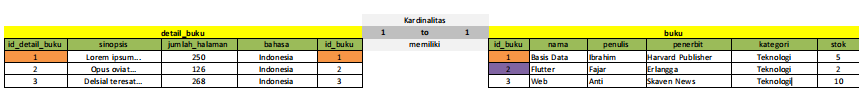
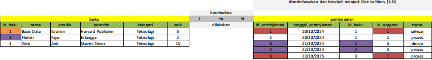
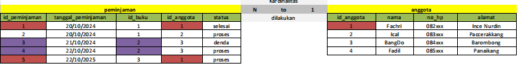
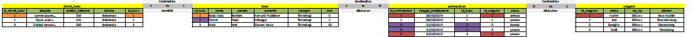

| No  | Nama            | Peran                       | Nilai |
| --- | --------------- | --------------------------- | ----- |
| 1   | Fachri Ramadan  | Mencari Bagian one to one   | 3     |
| 2   | M.Nafan Nabil   | Membuat Tabel               | 3     |
| 3   | Raihan Alfazari | Mencari Bagian One to Many  | 3     |
| 4   | Muhammad Fadhil | Mencari Bagian Many to Many | 3     |
**Keterangan :**
0 : Tidak Aktif
1 : Kurang Aktif
2 : Cukup Aktif
3 : Sangat Aktif
# 1. Jelaskan relasi 1-1, 1-N, dan N-N berdasarkan studi kasus tadi yang telah guru jelaskan. Sertakan ERD, contoh tabel, dan deskripsi dari setiap relasi yang terjadi.

## Relasi 1-1 (One-to-One)
Deskripsi: Setiap entitas dalam tabel A hanya berhubungan dengan satu entitas di tabel B dan sebaliknya.

 Contoh Studi Kasus: Relasi antara tabel Buku dan Detail_Buku.
- Setiap buku hanya memiliki satu detail buku, seperti sinopsis, jumlah halaman, dan bahasa.
- Setiap entri di tabel Detail_Buku juga hanya terkait dengan satu entri di tabel Buku.

### Contoh Tabel

| id_buku | nama_buku  | penulis | penerbit          |
| ------- | ---------- | ------- | ----------------- |
| 1       | Basis Data | Ibrahim | Harvard Publisher |
| 2       | Flutter    | Fajar   | Erlangga          |

| id_detail_buku | id_buku | sinopsis       | jumlah_halaman | bahasa    |
| -------------- | ------- | -------------- | -------------- | --------- |
| 1              | 1       | Lorem ipsum... | 250            | indonesia |
| 2              | 2       | Lorem ipsum... | 126            | indonesia |
### Contoh Tabel

## Relasi 1-N (One-to-Many)
Deskripsi: Satu entitas di tabel A dapat berhubungan dengan banyak entitas di tabel B, tetapi satu entitas di tabel B hanya terkait dengan satu entitas di tabel A.

Contoh Studi Kasus: Relasi antara tabel Buku dan Peminjaman.
- Setiap buku dapat dipinjam berkali-kali, tetapi setiap entri peminjaman hanya terkait dengan satu buku tertentu.

### Contoh Tabel

| id_buku | nama_buku  | penulis | penerbit          |
| ------- | ---------- | ------- | ----------------- |
| 1       | Basis Data | Ibrahim | Harvard Publisher |
| 2       | Flutter    | Fajar   | Erlangga          |

| id_peminjaman | id_buku | tanggal_peminjaman | status  |
| ------------- | ------- | ------------------ | ------- |
| 1             | 1       | 20/10/2024         | selesai |
| 2             | 2       | 21/10/2024         | denda   |
| 3             | 3       | 22/10/2024         | proses  |

### Contoh Tabel

## Relasi N-N (Many-to-Many)
Deskripsi: Satu entitas di tabel A dapat berhubungan dengan banyak entitas di tabel B, dan sebaliknya, satu entitas di tabel B juga dapat berhubungan dengan banyak entitas di tabel A.

Contoh Studi Kasus: Relasi antara tabel Anggota dan Buku melalui tabel penghubung Peminjaman.
- Satu anggota dapat meminjam banyak buku, dan satu buku dapat dipinjam oleh banyak anggota.
- Dibutuhkan tabel Peminjaman sebagai penghubung antara Anggota dan Buku untuk menyimpan informasi peminjaman

### Contoh Tabel

| id_anggota | nama_anggota | no_hp |
| ---------- | ------------ | ----- |
| 1          | Fachri       | 082xx |
| 2          | Nafan        | 083   |

| id_buku | nama_buku  | penulis |
| ------- | ---------- | ------- |
| 1       | Basis Data | Ibrahim |
| 2       | Flutter    | Fajar   |

| id_peminjaman | id_buku | id_anggota | tanggal_peminjaman |
| ------------- | ------- | ---------- | ------------------ |
| 1             | 1       | 1          | 20/10/2024         |
| 2             | 1       | 2          | 21/10/2024         |
| 3             | 2       | 1          | 22/10/2024         |
### Contoh Tabel

### Tabel Keseluruhan

# Contoh ERD Perpustakaan
![[hp2.png]]

