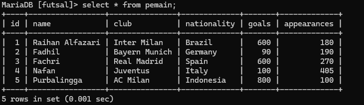
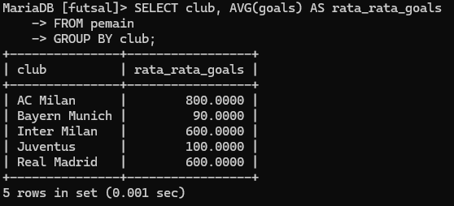
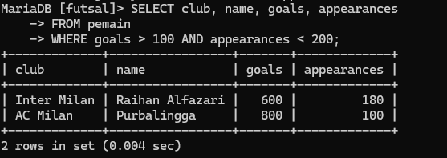

#### Tabel Keaktifan

| No  | Nama            | Peran            | Nilai |     |
| --- | --------------- | ---------------- | ----- | --- |
| 1   | Fachri Ramadhan | Menjawab Soal 2A | 3     |     |
| 2   | Rayhan Alfazari | Menjawab Soal 2B | 3     |     |
| 3   | M Nafan Nabil   | Menjawab Soal 1  | 3     |     |
| 4   | Muhammad Fadhil | Menjawab Soal 2C | 3     |     |
**Keterangan :**
0 : Tidak Aktif
1 : Kurang Aktif
2 : Cukup Aktif
3 : Sangat Aktif
### Tantangan Group BY 1
1. {A/B/C} AVG (Gaji) > 10.000.000
2. {A/B/C} Gaji > 10.000.000

A. Where
B. Having
C. Group By

### Jawaban :
1. Jawaban yang tepat adalah "B", alasan menggunakan HAVING adalah karena kita berurusan dengan fungsi agregat (AVG). Setelah data dikelompokkan dengan GROUP BY, kita menggunakan HAVING untuk menyaring hasilnya

2. Jawaban yang tepat adalah "A", alasan menggunakan WHERE adalah karena kita hanya membandingkan nilai biasa, yaitu gaji, tanpa ada pengelompokan atau fungsi agregat yang terlibat. WHERE menyaring data sebelum dilakukan pengelompokan.


### Tantangan Group BY 2

(Gambar 1.1) Data yang akan digunakan untuk praktik

1. Tampilkan data pemain dengan goals > 100 dan dikelompokkan berdasarkan kebangsaan!
2. Tampilkan data rata-rata gol pemain dan dikelompokkan berdasarkan club!
3. Tampilkan data pemain dengan gol rata-rata > 100 dan total tampil < 200, dikelompokkan berdasarkan club!

### Jawaban :
1. **Kode Program :**
```mysql
SELECT nationality, SUM(goals) AS total_goals
    -> FROM pemain
    -> WHERE goals > 100
    -> GROUP BY nationality;
```
**Hasil Program :**

(Gambar 2.1) Hasil Program
**Penjelasan :**
- **`SELECT nationality, SUM(goals) AS total_goals`**:
    
    - Bagian ini memilih dua kolom untuk ditampilkan dalam hasil: `nationality` dan `SUM(goals)`.
    - `nationality` adalah kolom yang menyimpan informasi tentang kewarganegaraan setiap pemain.
    - `SUM(goals)` menghitung total gol yang dicetak oleh semua pemain dari setiap negara yang memenuhi syarat (yaitu, mereka telah mencetak lebih dari 100 gol). Alias `total_goals` memberikan nama baru untuk hasil perhitungan ini agar lebih mudah dibaca.
- **`FROM pemain`**:
    
    - Bagian ini menunjukkan bahwa tabel `pemain` adalah sumber data yang digunakan dalam query ini.
- **`WHERE goals > 100`**:
    
    - Kondisi `WHERE` ini memfilter data untuk hanya menyertakan pemain yang mencetak lebih dari 100 gol.
- **`GROUP BY nationality`**:
    
    - Bagian ini mengelompokkan hasil berdasarkan kolom `nationality`.
    - Artinya, total gol (`SUM(goals)`) akan dihitung untuk setiap kelompok `nationality` yang berbeda.


2. **Kode Program :**
```mysql
SELECT club, AVG(goals) AS rata_rata_goals
    -> FROM pemain
    -> GROUP BY club;
```
**Hasil Program :**

(Gambar 2.2) Hasil Program
**Penjelasan :**
- **SELECT club, AVG(goals) AS rata_rata_goals**:
    
    - Bagian ini memilih kolom `club` dari tabel `pemain` dan menggunakan fungsi agregat `AVG()` untuk menghitung rata-rata dari kolom `goals`.
    - `AVG(goals)` menghasilkan rata-rata nilai di kolom `goals` untuk setiap grup yang terbentuk, dan `AS rata_rata_goals` memberikan alias (nama lain) pada hasil rata-rata tersebut, sehingga hasilnya bisa ditampilkan dengan nama `rata_rata_goals`.
- **FROM pemain**:
    
    - Ini menunjukkan bahwa data yang akan diambil berasal dari tabel `pemain`.
- **GROUP BY club**:
    
    - Bagian ini mengelompokkan data berdasarkan kolom `club`, sehingga rata-rata gol akan dihitung untuk setiap klub secara terpisah.
    - `GROUP BY` memecah data menjadi kelompok-kelompok berdasarkan nilai di kolom `club`. Setiap kelompok akan berisi data semua pemain dari satu klub, sehingga `AVG(goals)` akan diterapkan untuk menghitung rata-rata gol pada masing-masing kelompok klub

3. **Kode Program :**
```mysql
SELECT club, name, goals, appearances
    -> FROM pemain
    -> WHERE goals > 100 AND appearances < 200;
```
**Hasil Program :**

(Gambar 2.3) Hasil Program
**Penjelasan :**
- **SELECT club, name, goals, appearances**:
    
    - Bagian ini memilih kolom `club`, `name`, `goals`, dan `appearances` dari tabel `pemain`.
    - Kolom-kolom yang dipilih akan muncul sebagai hasil dari query, sehingga kita bisa melihat klub, nama pemain, jumlah gol, dan jumlah penampilan pemain yang memenuhi kriteria tertentu.
- **FROM pemain**:
    
    - Menunjukkan bahwa data diambil dari tabel `pemain`.
- **WHERE goals > 100 AND appearances < 200**:
    
    - Bagian ini menyaring data berdasarkan kondisi tertentu menggunakan klausa `WHERE`.
    - `goals > 100` menyeleksi pemain yang telah mencetak lebih dari 100 gol.
    - `appearances < 200` menyeleksi pemain yang memiliki kurang dari 200 penampilan.
    - Kondisi `AND` memastikan bahwa kedua kriteria ini harus terpenuhi untuk pemain yang terpilih dalam hasil akhir.
